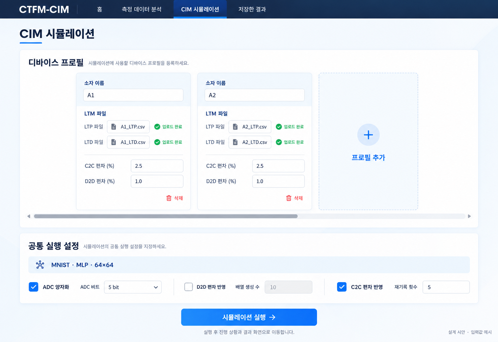

# 최종 구현·검증 인수인계 — 확정본

- 작성일: 2026-10-02
- 상태: **사용자 범위 확정 완료. 개발 담당자는 본 문서 기준으로 구현·검증을 진행한다.**
- 목적: 확정된 연구·구현·프론트 범위를 한 번에 인계하고 완료 기준까지 검증한다.
- 이 문서 작성은 구현·검증·커밋·푸시·PR 병합을 의미하지 않는다.
- 관련 PR: https://github.com/jeom391/ctfm-cim-simulations/pull/7
- 기존 작업 브랜치: `codex/handoff-ui-data-2026-09-29`
- 기존 PR 대상 브랜치: `claude/adc-order-comparison`. 최종 작업 시 실제 상태를 확인하고 임의로 변경하지 않는다.

## 1. 완료 목표와 범위

합의된 범위 안에서 측정 분석, 시뮬레이터 실행, 결과 저장·재조회 및 인수인계를 마무리한다. 단순히 한 번 실행되거나 테스트가 통과한 것으로 종료하지 않고, 알려진 결함을 수정하고 영향을 받는 흐름을 다시 검증한다.

연구 가정이나 측정 한계를 소프트웨어 결함과 구분한다. 측정으로 확인하지 않은 내용을 검증 완료로 표시하지 않는다. 새로운 기능을 계속 추가하기보다 확정 범위의 완성을 우선한다.

### 유지하는 범위

- 배열 64×64 고정.
- MNIST 정확도 평가 및 ADC 설정 유지.
- PPA 화면·새 실행에서 제외 유지. 전체 가속기 PPA는 후속 범위.
- 측정 분석 페이지와 시뮬레이터 사용자 흐름 분리 유지.
- 시뮬레이터 프로필에서 LTP/LTD 파일을 업로드하고, C2C·D2D 상대 편차를 직접 입력하는 구조 유지.
- 여러 프로필은 공통 실행 조건으로 비교한다.
- 결과 이름 저장·재조회·새로고침·복제·폐기 기능 유지.
- 기존 결과와 원자료는 보존한다.

## 2. C2C — 확정된 방향

### 2.1 두 분석값을 모두 제공

동일한 50-cycle 데이터에서 다음 두 종류의 편차를 모두 계산한다.

1. **전체 반복 변동:** 아무 추세도 제거하지 않은 전체 50개 측정값의 표준편차 및 상대 편차.
2. **추세 제거 후 변동:** 명시한 추세 모델을 적용하고 잔차로부터 계산한 상대 편차.

어느 하나를 유일한 정답으로 취급하지 않는다. 초기 사이클이나 튀는 값을 편차를 줄이기 위해 임의로 제외하지 않는다. 입력 오류·결측이 있으면 위치와 처리 상태를 명시한다.

상승·하강 스윕은 별도로 분석한다. 같은 스윕 구간의 같은 읽기 지점끼리만 비교한다. 최초 0 V 값은 상승·하강 중 0 V와 섞지 않는다.

### 2.2 시뮬레이터는 입력칸 하나 유지

- 프로필마다 **C2C 상대 편차 CV(%) 입력칸 하나**를 유지한다.
- 전체 변동 값으로 한 번, 추세 제거 후 값으로 별도 실행한다.
- 두 편차를 동시에 입력해 두 종류의 결과를 자동 생성하는 구조는 추가하지 않는다.
- 이름을 붙여 저장할 때 `전체 변동` / `추세 제거 후 변동`을 구분한다.
- 비교 실행은 LTM 파일, 모델 가중치, ADC, 배열·재기록 횟수 및 난수 조건을 동일하게 유지한다. 가능하면 설정 복제를 사용한다.
- 상승·하강 중 대표 구간은 소자팀의 대응 관계 확인 후 정한다. 작은 편차를 얻기 위해 구간을 선택하지 않는다.
- 상승·하강을 양수·음수 가중치에 대응시키지 않는다. LTP/LTD 방향도 가중치 부호와 다르다.
- 대표값 하나를 해당 프로필의 전체 전도도 상태에 공통 적용하는 기존 근사 가정을 유지한다.
- A2의 수치를 다른 조건의 측정값으로 자동 채우지 않는다. 후속 파일은 동일 계산 규칙으로 분석한다.

### 2.3 현재 A2 원자료와 계산 결과

원자료: `관련 자료/C2C/A2_C2C_50Cycles.xlsx`

SHA-256: `49959edc4e089eec8f823a14effba9f1765a262642ed0051c022452ee77e52d9`

한 사이클의 전압 경로는 0 → −15 → +15 → −15 V이다. 501개 전압 지점에 대한 전류가 50개 사이클 열에 들어 있다. 원본 주석상 0 V 값은 스윕 중 측정점이며 별도의 읽기 펄스 측정이 아니다. 반복 간 동일한 초기 상태가 보장되었다고 단정하지 않는다.

| 구간 | Id_sweeps 범위 | 평균 전류 (µA) | 표본 SD (µA) | 전체 CV (%) |
|---|---|---:|---:|---:|
| 최초 0 V | B2:AY2 | 19.024840 | 0.681346 | 3.581349 |
| 상승 중 0 V | B202:AY202 | 25.255400 | 1.534398 | 6.075524 |
| 하강 중 0 V | B402:AY402 | 4.538944 | 0.113931 | 2.510084 |

파일의 VDS와 기록 절차는 별도 확인 대상이다. VDS가 사이클마다 같은 양수이면 전류 CV와 전도도 CV는 수학적으로 같다. LTM과 동작점이 같은지는 별개다.

### 2.4 계산식 — 전체 변동

같은 구간의 전류를 I_n, N=50으로 둔다.

```text
mean_I = sum(I_n) / N
s_I = sqrt(sum((I_n - mean_I)^2) / (N - 1))
c_observed = s_I / abs(mean_I)
CV_observed_percent = 100 * c_observed
```

평균이 0이거나 입력이 유효하지 않으면 계산 불가로 표시한다. 음수 측정값을 자동으로 절댓값 처리하여 통과시키지 않는다.

### 2.5 계산식 — 확정된 추세 제거 정의

**선형 추세 → 시점별 상대 잔차 → 표본 표준편차로 확정한다. 전체 변동과 함께 제공하고 사용자가 하나를 선택해 시뮬레이터에 수동 입력한다.**

```text
n = 1, ..., N
T_n = a + b*n                  # 전체 50개로 최소제곱 직선 적합
r_n = I_n - T_n
e_n = r_n / T_n                # 각 사이클의 추세값 기준 상대 잔차
c_residual = sqrt(sum((e_n - mean(e))^2) / (N - 1))
CV_residual_percent = 100 * c_residual
```

- 모든 T_n이 양수이며 유한한지 확인한다. 조건을 만족하지 않으면 이 정규화 결과를 제공하지 않는다.
- 명칭은 `추세 제거 후 상대 잔차 표준편차(%)`로 명확히 한다. 순수한 C2C나 열화만 제거한 값이라고 표시하지 않는다.
- 이 식의 N−1은 계산된 상대 잔차의 표본 표준편차를 보고하는 정의다. 독립 잡음 분산의 불편 추정량이라고 주장하지 않는다.
- 회귀 오차 추정식 `sqrt(sum(r_n^2)/(N−p))/mean_I`와 위 식은 다른 정의다. 기존 결과를 이름만 바꿔 재사용하지 않는다.
- 앞서 계산한 선형 잔차 CV 3.083357%/2.506502%는 회귀 잔차 SD를 전체 평균으로 나눈 값이다. 위 상대 잔차 방식의 최종 수치가 아니므로 재계산해야 한다.
- 3차식은 필요 시 분석 방법에 대한 민감도 확인용 보조 결과로만 검토한다. 기본 구현을 자동 모델 선택이나 여러 모델 UI로 확장하지 않는다.
- 선형 잔차에 연속성이 남는다는 사실을 기록한다. 그것이 C2C 분석 불가를 의미하지는 않으며, 독립 무작위 변동만 추출했다고 주장할 수 없다는 의미다.

### 2.6 시뮬레이터 적용식 — 기존 구현 유지

```text
c = CV_percent / 100
tau = sqrt(log(1 + c^2))        # 구현에서는 log1p 사용
Z ~ Normal(0, 1)
F = exp(-tau^2/2 + tau*Z)
G_written = G_nominal * F
w_written = scale * (G_plus_written - G_minus_written)
```

- E(F)=1, SD(F)=c인 양수 배율이다.
- 소자·재기록별 배율을 생성한다. 매 입력 이미지마다 새 잡음을 생성하지 않는다.
- D2D를 함께 적용하면 배열별 고정 D2D 배율 위에 재기록별 C2C 배율을 곱한다.
- 전도도 두 평면에 적용하며 직접 `w*(1+noise)`로 대체하지 않는다.
- Vth 표준편차(V)를 전류·전도도 CV(%) 칸에 넣지 않는다.
- 로그정규 분포와 상태 전체에 공통 CV를 적용하는 것은 공학적 가정이다. 실측 분포가 로그정규임을 입증한 것은 아니다.
- 원래 전도도 범위로 강제 clipping을 추가하는 것은 이번 변경 범위에 넣지 않는다. 기존 범위 이탈 진단은 유지한다.

### 2.7 보고서에 기록할 한계

> 제한된 반복 스윕에서 체계적인 변화와 확률적 변동을 완전히 분리하기 어렵다. 전체 변동에는 사이클에 따른 추세가 포함될 수 있고, 추세 제거 후 변동은 선택한 모델과 정규화 방식에 의존한다. 두 추정값을 각각 대표 전도도 변동으로 적용하여, 추정 방법에 따른 정확도 차이를 비교한다. 이는 모든 LTM 상태의 실제 반복 기록 편차를 개별 측정한 결과가 아니다.

전체 변동을 적용한 실행은 시간 순서의 열화를 재현하지 않는다. 추세 제거 실행도 열화만 완전히 제거한 실행으로 해석하지 않는다.

### 2.8 소자팀 확인 문구

> 보내주신 50-cycle 데이터에서 상승·하강 스윕의 0 V 전류를 각각 분석해, 전체 변동과 추세 제거 후 변동을 구하려고 합니다. 시뮬레이터에는 대표 편차 하나를 전체 LTM 상태에 공통 적용할 예정인데, 기존 LTP/LTD 측정의 기록 상태를 대표하려면 상승·하강 중 어느 구간이 더 적절할까요? 직접 대응하기 어렵다면 그 점도 알려주세요. 측정 시 VDS가 0.1 V였는지도 확인 부탁드립니다.

## 3. D2D — 두 소자 기준 유지

2026-10-02 최신 관련 자료/D2D/A1~A5 폴더를 직접 확인했다. 각 조건에 사용자가 지정한 파일이 두 개씩 있으며 총 10개다. 이번 스냅샷의 해당 두 파일을 그대로 사용한다. 파일번호를 물리 소자번호로 임의 해석하지 않고 선택된 파일 쌍을 추적한다.

소자팀과 합의한 대로 기존 **두 소자 기준 구현을 유지**한다. 세 소자 지원으로 확장하지 않는다. 조건 폴더의 지정된 두 파일을 같은 측정 조건끼리 비교하며, 다른 파일 쌍을 추가로 요구하지 않는다. 파일 형식 문제가 있으면 구체적 원인을 보고하고 물리적 조건을 임의로 바꾸지 않는다.

### 3.1 조건별 계산

```text
G1 = I1 / VDS
G2 = I2 / VDS
mean_G = (G1 + G2) / 2
s_G = sqrt(((G1-mean_G)^2 + (G2-mean_G)^2)/(2-1))
    = abs(G1-G2) / sqrt(2)
CV_k = s_G / mean_G
```

이는 N=2인 일반적인 표본 표준편차와 변동계수다. 소자별 CV 두 개를 합친 것이 아니라, 같은 조건에서 두 소자의 차이로 CV 하나를 구한다.

### 3.2 여러 조건의 대표값

```text
CV_D2D = sqrt(sum(CV_k^2)/K)
UI_percent = 100 * CV_D2D
```

- K는 두 소자 모두 유효하게 대응되는 비교 조건 수다.
- 조건별 CV를 RMS로 요약하는 것은 기존 구현의 집계 가정이다. D2D의 유일한 표준 공식이라고 설명하지 않는다.
- K=1이면 그 조건의 CV가 그대로 대표값이다.
- 결과는 `선택한 물리 소자 2개 기준 대표 편차`다. 소자 집단 전체의 정확한 분포를 확정한 값이라고 주장하지 않는다.
- 파일명·물리 소자번호·비교 조건·유효 쌍과 제외 사유는 결과 추적에 남긴다. 이를 모두 복잡한 필수 사용자 입력으로 노출할지는 프론트 요구사항에서 결정한다.
- 시뮬레이터에서는 기존 D2D CV 수동 입력과 배열별 고정 배율을 유지한다.

## 4. Retention — 확정

- 실측 분석과 장기 외삽 모두 측정 분석 화면에서 제공한다.
- 실측과 외삽을 그래프의 실선/점선 및 범위 경계로 명확히 구분하고 단위·모델·측정 기간을 표시한다.
- 교차 시점과 10년 값은 모델에 의존한 외삽 결과이며 실제 수명이나 실측 검증으로 표시하지 않는다.
- 음수·비유한 예측값을 0으로 잘라 정상 결과처럼 표시하지 않는다. 해당 구간은 모델 유효성 문제를 표시한다.
- **정확도 시뮬레이터에는 Retention을 적용하지 않는다.** 관련 입력이나 결과 열을 새 실행에 되살리지 않는다.
- 기존 기록과 원자료를 보존한다.

## 5. 프론트 수정사항 — 1차 요청 반영

아래 9절의 상세 요구사항을 따른다. Retention은 4절의 최신 확정 사항이 우선한다.

지금까지 제기된 항목:

- 사용하지 않는 항목이 `—`로 반복 표시되는 잔재 정리.
- 업로드 카드의 `상태 —개`, 프로필 UUID/revision 등 불필요한 기술 정보 노출 검토.
- Retention 외삽 안내 문구와 실제 제공 범위 일치.
- 결과 표와 그래프의 단위·명칭·표시값 일치.
- 성공 시 불필요한 세부정보를 강요하지 않고, 필요한 오류는 원인과 조치가 보이도록 표시.
- 사용자에게 반복적인 수동 업로드 테스트를 요청하기 전에 개발자가 알려진 오류를 먼저 해결.

화면별 구현 범위(9절에 상세 명세):

1. 측정 분석 페이지: 9절에 따라 정리.
2. C2C 두 분석 결과 표시 및 복사: 9절에 따라 정리.
3. D2D 두 파일 선택 흐름: 9절에 따라 정리.
4. 시뮬레이터 프로필·공통 설정: 9절에 따라 정리.
5. 결과·그래프·저장 목록: 9절에 따라 정리.
6. Retention 실측/외삽 표시: 9절에 따라 정리.

## 6. 결정 상태 — 구현을 위한 추가 선택 없음

| 항목 | 확정 내용 |
|---|---|
| C2C | 전체 변동 + 선형 추세 제거 후 상대 잔차 표준편차 둘 다 계산 |
| 시뮬레이터 C2C | 입력칸 하나 유지, 사용자가 선택한 값으로 별도 실행 |
| 대표 스윕 구간 | 사용자가 나중에 선택. 분석·수동 입력 구현을 막지 않음 |
| D2D | 최신 스냅샷 D2D/A1~A5의 각 두 파일 사용 |
| Retention | 분석에서 실측·외삽 모두 제공, 시뮬레이터 미반영 |
| 다운로드 | 개발자가 실제 파일 용도를 조사해 사용자 결과만 노출하도록 정리 |
| 카드 수 제한 | 실제 제약 조사 후 해제, 필요 근거가 있으면 유지 가능 |
| 프론트 | 9절과 시안을 기준으로 구현 |

대표 구간 선택 전 결과를 자동으로 승인하거나 특정 구간을 정답으로 채우지 않는다. 소프트웨어 완료와 연구 결과의 최종 선택은 별개다.

## 7. 최종 작업 지시서에 포함할 완료 기준

아래 기준을 모두 충족할 때 완료로 보고한다.

1. 실제 최신 파일로 분석식을 검증하고, 원본의 선택 범위와 단위 및 분모 정의를 기록한다.
2. C2C 전체 변동과 잔차 변동을 독립 재계산하여 구현 결과와 대조한다. 두 값이 같아야 한다거나 작아져야 한다는 조건을 넣지 않는다.
3. D2D는 지정된 두 물리 소자와 동일 조건으로 계산하고 표준편차 및 RMS 결과를 대조한다.
4. 측정 분석 이력 없이도 시뮬레이터에서 LTM 업로드와 실행이 가능해야 한다.
5. 실제 AIHWKit 경로로 실행했는지 확인한다. 다른 엔진으로 대체한 결과를 동일한 검증으로 보고하지 않는다.
6. 동일 조건에서 C2C OFF, 전체 변동 입력, 잔차 변동 입력을 별도 실행하고 입력값이 실제 계산에 전달됨을 확인한다. 확정된 D2D 적용도 확인한다.
7. 저장·새로고침·재조회·복제·일부 파일 교체·폐기를 실제 흐름으로 확인한다. 기존 저장 결과도 보존되어야 한다.
8. 알려진 표시 오류와 동작 오류를 먼저 수정한 후 전체 흐름을 검증한다. 실패가 있으면 원인을 수정하고 영향을 받는 검증을 반복한다.
9. 직접 확인한 항목, 자동 테스트만 확인한 항목, 측정 조건 확인이 남은 항목을 구분한다. 필요 없는 테스트를 반복하여 마감을 지연하지 않는다.
10. 최종 산출물에 변경 요약, 적용 수식, 연구 가정, 실제 실행 조건·결과, 실행/종료 방법, 남은 항목 유무를 포함한다.
11. PR 업데이트와 병합은 그때의 사용자 지시 범위를 따른다. 이 저장본은 병합 승인이 아니다.

## 8. 수식 근거 및 기존 분석 자료

- 표본 표준편차: https://www.itl.nist.gov/div898/handbook/eda/section3/eda356.htm
- 회귀 잔차 분석·회귀 잔차 SD: https://www.itl.nist.gov/div898/handbook/pri/section6/pri619.htm
- 로그정규 분포: https://www.itl.nist.gov/div898/handbook/eda/section3/eda3669.htm
- 반복 스윕에서 고정 전류에 해당하는 게이트 전압의 C2C 평가 사례: https://pmc.ncbi.nlm.nih.gov/articles/PMC9616899/
- LTP/LTD 반복에서 동일 펄스 위치의 전도도 변동 평가 사례: https://advanced.onlinelibrary.wiley.com/doi/10.1002/aisy.202300554

문헌 사례는 반복 변동 평가의 근거다. 우리 소자의 모든 LTM 상태에 동일 CV를 적용하는 가정이나 특정 추세 모델의 물리적 타당성을 자동으로 입증하지 않는다.

이전 내부 분석:

- `local_report/A2-c2c-model-2026-10-01/analysis-and-application.md`
- `local_report/A2-c2c-model-2026-10-01/summary.json`
- `local_report/A2-c2c-model-2026-10-01/cycle-values.csv`

이전 문서의 '원자료 CV 하나를 추천'한 내용은 본 대화에서 합의한 **전체 변동과 추세 제거 후 변동을 모두 계산하고 별도 실행**하는 방향으로 대체한다. 수치의 계산 정의가 다른 부분은 재계산 전까지 혼용하지 않는다.

## 9. 프론트 인수인계 — 확정 범위

### 9.1 디자인 방향과 기준 이미지

사용자가 제공한 초기 목업의 흰색·연한 파란색 배경, 남색 내비게이션, 파란색 강조 버튼을 따른다. 초기 그림은 기능 명세가 아니라 시각 참고다. CNN, PPA, 배열 크기 선택, pool/mapping, seed/checkpoint, 프로필 발행 연동 등을 그림에 있다는 이유로 복원하지 않는다.

사용자의 그림판 스케치를 배치 기준으로 삼는다: **세로형 카드가 가로로 나열 → 카드 영역 안에서 가로 스크롤 → 그 아래 공통 설정 → 실행하면 진행·결과 화면으로 이동**.



- 이미지: `handoff/assets/simulator-ui-concept-2026-10-02.png`
- 생성 기록: `handoff/assets/simulator-ui-concept-2026-10-02-prompt.md`
- built-in image_gen으로 제작한 설계 참고 시안이며 실제 실행 화면이 아니다.
- 이미지의 2.5%, 1.0%, 반복 횟수는 예시다. 측정값·기본값·효과 ON/OFF 정책으로 채택하지 않는다. C2C/D2D 기본 OFF 유지.
- 그림과 명세가 다르면 명세가 우선이다. 글자·선택값을 이미지로 렌더링하지 않고 실제 폼과 접근 가능한 UI로 구현한다.

### 9.2 입력 화면

- 큰 프로필 영역에 좁은 세로형 카드들을 한 줄로 배치한다. 마지막에 `+ 프로필 추가` 카드/버튼을 둔다.
- 카드 폭을 확보하되 전체 페이지가 가로로 넘치지 않게 한다. 카드 영역에만 가로 스크롤을 적용한다. 스크롤바는 발견 가능하게 유지한다.
- 추가한 카드를 화면 안으로 이동하고 키보드 포커스를 제공한다. 삭제 후 나머지 카드의 파일·입력값이 다른 카드에 붙지 않도록 안정적인 카드 식별자를 사용한다.
- 작은 화면에서도 입력을 사용할 수 있도록 폭과 스크롤을 검증한다. CSS만으로 카드를 극단적으로 축소하지 않는다.
- 카드의 기본 노출은 **소자 이름 / LTM 파일 / C2C CV(%) / D2D CV(%) / 삭제**로 제한한다.
- LTM은 기존에 지원하는 LTP·LTD 파일 한 쌍을 하나의 업로드 영역 안에서 다룬다. 시안 때문에 새 통합 XLSX 형식을 필수로 만들지 않는다.
- 성공 시 파일명과 완료 상태만 보여준다. 상태 개수·전도도 범위·UUID·revision·발행 상태·candidate ID·분석 ID·원시 JSON은 일반 폼에서 숨긴다.
- 오류는 해당 카드에 원인과 수정 방법을 표시한다. 잘못된 파일로 재업로드 시 정상인 다른 카드와 이전 유효 결과를 훼손하지 않는다.
- 비이상성 OFF에서는 CV 미입력이 실행을 막지 않아야 한다. ON이면 필요한 해당 카드의 값만 검증한다. 실제 0과 미입력은 구분한다.
- 카드 아래 공통 설정에 ADC ON/OFF와 비트수, D2D/C2C ON/OFF, 적용되는 배열·재기록 횟수를 모은다. 카드마다 공통 설정을 반복하지 않는다.
- MNIST·MLP·64×64는 고정 조건으로 짧게 명시한다. 엔진·seed·checkpoint·pool·mapping 선택은 내부에서 기존 확정 정책대로 유지한다.
- 하단 버튼 명칭은 `시뮬레이션 실행`을 제안한다. 측정 분석의 실행과 혼동하지 않도록 한다.

### 9.3 입력 → 진행 → 결과 흐름

- 실행 시 진행 화면으로 이동하고 완료 후 해당 결과를 보여준다. 기존 작업/비교 ID를 유지한다. 반드시 새 API나 상태 모델을 만들 필요는 없으며 기존 라우트 안의 화면 분리도 가능하다.
- 진행 화면에서는 실제 상태만 표시한다. 근거 없는 완료율·예상시간을 만들지 않는다.
- 새로고침과 재접속으로 실행이 중복 생성되지 않도록 한다.
- 결과 화면에는 디지털 기준 정확도와 공통 조건을 한 번만 표시하고, 프로필별 매핑 후 정확도·효과 적용 후 정확도·변화(%p)를 표와 묶음 막대그래프로 보여준다.
- 미사용 열은 제거한다. 실패·미완료 데이터를 정상 0으로 표시하거나 단순히 숨기지 않는다.
- 이름 저장·다시 열기·복제·폐기 흐름은 유지한다. 폐기는 해당 임시 결과 범위에 한정하며 공유 파일이나 저장된 기록을 지우지 않는다.
- 과거 Retention 결과는 손상 없이 보존하되, 새 결과 화면에 과거 미사용 열이 섞이지 않도록 한다.

### 9.4 프로필 5개 제한

사용자 요청: 가능하면 5개 한도와 `1/5`, `2/5` 표기를 없앤다. 실제 구현상 제약이 있으면 유지해도 된다.

현재 코드 확인:

- `apps/web/src/pages/simulator/Comparison.tsx`: 카드 수 5 이상에서 추가 비활성화, 카드 수 / 5 표시.
- `apps/api/src/ctfm_api/comparison_models.py`: cards 목록에 `max_length=5` 존재.
- 따라서 화면만 바꾸면 API에서 거절된다. 5개는 확인된 현재 제한이며 본질적인 엔진 제약인지는 아직 확인되지 않았다.

개발 절차:

1. API·계약 스키마·생성 타입·실행 후보 제한·저장·복제·전체 작업 수 제한을 함께 확인한다.
2. 5가 단순한 임의 UI/스키마 제한이면 관련 제한을 일관되게 제거하고 6개 이상으로 생성·저장·실행 흐름을 검증한다.
3. 작업 수·메모리 등 실제 제약이 있으면 숫자를 임의로 10/20으로 바꾸지 말고 근거와 영향 범위를 보고한다. 이 경우 기존 한도 유지가 허용된다.
4. 5개 제한 제거를 무한 작업 동시 실행으로 해석하지 않는다. 기존 큐·리소스 보호를 유지한다.

### 9.5 다운로드 정리 — 사용자 결과와 내부 파일 분리

사용자 요청: 측정 분석에서 소자팀이 필요로 하는 결과 위주로 제공한다. 수십 개의 내부 산출물을 다운로드 목록에 그대로 나열하지 않는다. 불필요한 항목을 확인한 후 제거한다.

현재 확인한 원인:

- `apps/api/src/ctfm_api/storage/__init__.py`의 결과 수집이 출력 폴더를 재귀 순회하며 다수의 파일을 artifact로 등록한다.
- `apps/web/src/shared.tsx`의 `Downloads`는 전달된 artifacts 전체를 링크로 나열한다.
- `PlotArtifacts`는 PNG들을 나열하고 별도 다운로드 링크도 붙인다. 실제 호출 화면에 따라 다운로드와 그래프가 중복될 수 있다.

**일반 다운로드에서 숨기는 것과 실제 파일 삭제는 구분한다.** 체크포인트·배열 기록·진단·해시·프로필 등은 재실행 및 저장 복구에 필요할 수 있다. 의존성을 확인하기 전 실제 생성이나 보존을 제거하지 않는다.

우선 제안하는 사용자 다운로드:

| 화면 | 기본 제공 제안 | 기본 목록에서 제외 |
|---|---|---|
| 측정 분석 | 해당 분석의 결과 표 CSV 1개, 필요 시 현재 그래프 PNG | 원시 JSON, 내부 프로필, 로그, 배열·seed 기록 |
| C2C 분석 | 상승/하강별 전체·잔차 편차와 사용 조건을 담은 표 | 모델마다 중복된 개별 내부 파일 |
| D2D 분석 | 두 소자·조건별 편차와 대표값을 담은 표 | 내부 요청·manifest 파일 |
| Vth/MW 분석 | 소자팀에 전달할 추출 결과 표 | 실행 내부 파일 |
| Retention 분석 | 확정된 표시 범위의 실측 결과 표·그래프 | 불필요한 개별 내부 산출물 제외; 분석에서 외삽 제공 확정; 실측/외삽 구분하여 제공 |
| 시뮬레이션 | 이름 저장을 기본 제공. 요약 CSV 1개와 그래프 PNG는 선택 기능 제안 | checkpoint.pt, 배열 NPZ, 재기록별 JSON, 원시 요청·진단 파일 수십 개 |

CSV/PNG는 지원이 확인된 형식으로 제한하고 새로운 PDF/Excel 보고서 체계를 자동 추가하지 않는다. 시뮬레이션 다운로드를 아예 없앨지, 요약 CSV/PNG만 둘지는 개발 담당자가 사용 목적과 구현 범위를 확인해 결정하고 최종 보고에 남긴다. 추가 사용자 선택을 기본 차단 조건으로 만들지 않는다.

개발자는 실제 생성 파일 목록을 확인하여 각 파일을 `사용자 결과 / 내부 재현·복구 / 진단 / 중복`으로 분류하고, 노출 정책을 결정한다. 역할 기반 필터링으로 신규 내부 파일이 사용자 목록에 자동 노출되지 않게 한다. 확장자만으로 모든 CSV/PNG를 무조건 노출하는 방식은 피한다.

숨긴 뒤에도 저장 재조회·복제·실행·다운로드 링크가 정상인지 확인한다. 사용자 결과의 파일명은 분석 종류와 소자 이름으로 이해 가능하게 하고 필요한 단위·계산 방식·입력 조건을 표 안에 남긴다. 내부 파일을 담은 ZIP 하나로 바꾸는 것은 이 요구를 해결한 것으로 보지 않는다.

### 9.6 측정 분석·홈 디자인 적용

- 동일한 색상·글꼴·여백 체계를 적용한다. 홈은 측정 분석과 시뮬레이션 두 주요 진입점을 유지한다.
- 초기 목업의 `Device Profile로 저장` 버튼을 되살리지 않는다. 측정 분석 완료가 시뮬레이터 실행의 필수 조건이 되지 않아야 한다.
- 고정된 계산 조건은 읽기 전용으로 명시한다. 선택하지 않는 조건을 위해 드롭다운을 늘리지 않는다.
- 분석 종류에 맞는 결과만 보여준다. 아직 실행하지 않은 상태에 예시 수치를 실제 결과처럼 표시하지 않는다.
- AI 목업의 계정·알림 아이콘 등 현재 필요 없는 기능을 새로 만들지 않는다.

### 9.7 추가 완료 확인

- 카드 1개·여러 개·긴 파일명·오류·삭제·부분 교체·새로고침에서 레이아웃과 상태 보존 확인.
- 5개 제한 변경 시 최소 6개 사례로 API와 UI 일치 확인.
- 키보드로 카드 추가·입력·삭제·실행 접근 가능, 카드 영역 스크롤 가능.
- 입력→진행→결과→저장→재조회에서 표시 숫자와 실제 결과 일치 확인.
- 내부 파일 노출 제거 후 재실행·복제·기존 기록이 손상되지 않았는지 확인.
- 이번 저장본에서는 앱 코드 수정·서버 실행·브라우저 검증·커밋·푸시를 하지 않았다. 위 내용은 구현 요청을 위한 명세와 제한적 코드 확인 결과다.


## 10. 최신 데이터 인수인계와 완료 보고

- 최신 입력의 기준은 `data/team-snapshot/2026-10-02/files/`이다. 2026-09-29 스냅샷과 혼합하거나 누락된 파일을 과거 자료로 자동 보충하지 않는다.
- `data/team-snapshot/2026-10-02/manifest.json`에 원본 상대 경로·바이트 수·SHA-256을 기록했다. 원자료를 변경하지 않고 복사했으며 전체 해시를 대조했다.
- 원본 스냅샷 업로드는 측정 조건의 물리적 승인이나 분석 완료를 뜻하지 않는다.
- D2D는 A1 200/201, A2 233/234, A3 245/246, A4 232/233, A5 223/224 파일 쌍이다. 정확한 이름은 manifest를 따른다.
- C2C 신규 파일에는 원자료 양식 확인 후 확정된 동일 수식을 적용한다. A2 기존 분석값으로 다른 조건을 대체하지 않는다.
- 완료 보고에는 실제 적용 수식, 데이터 파일, 엔진, 테스트·브라우저 확인 범위, 수정 결과 화면, 실행 방법, 커밋 및 PR 상태를 남긴다.
- 알려진 구현 결함은 수정 후 재검증한다. 대표 CV의 연구적 선택은 별도 사용자 결정으로 남길 수 있으나 이를 구현 미완료와 혼동하지 않는다.

### 추세 제거식의 근거를 문서화할 때

선형 최소제곱은 관측값과 직선의 제곱 오차 합을 최소화하는 추세 추정이다. 상대 잔차 `(I−T)/T`는 그 시점의 추세값 대비 상대 오차이며, 그 표본 표준편차는 이 연구에서 채택한 무차원 변동 요약이다. 일반 통계 원리에 근거한 조합이지 특정 소자에서 열화만 완전히 분리하는 보편 법칙은 아니다. NIST 회귀 잔차 SD의 N−p 식을 이번 상대 잔차 표본 SD의 N−1 식과 혼동하지 않는다. 식·정규화·분모·모델 한계를 결과와 연구 문서에 함께 기록한다.
