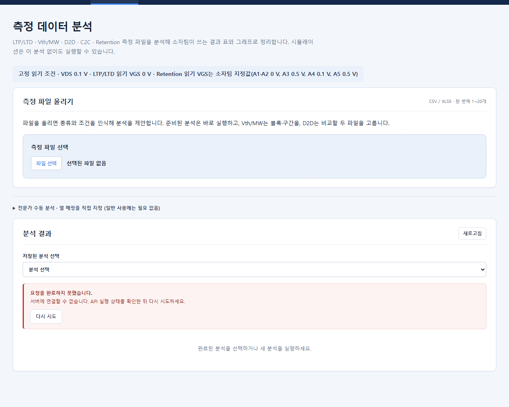
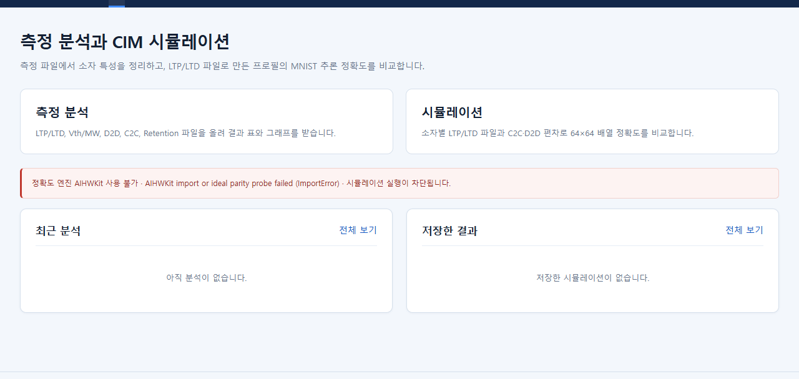
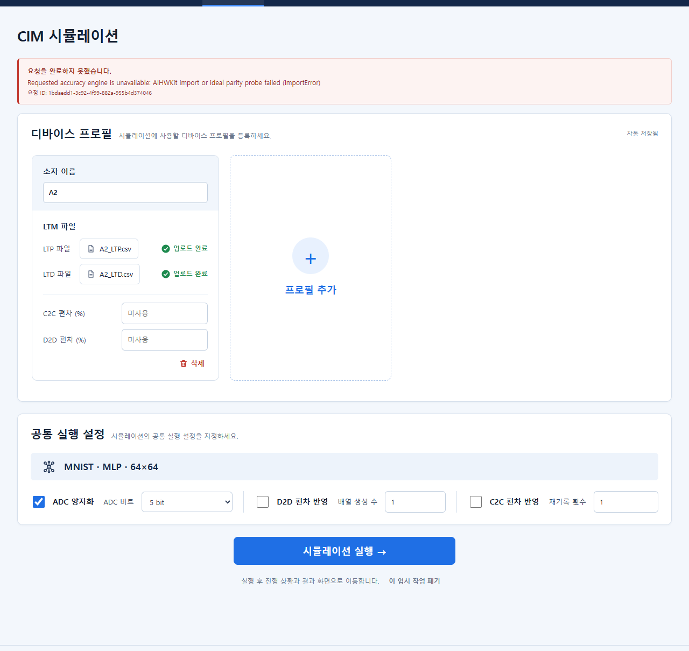

# 로컬 실행 안내서 — 환경 준비 · 실행 · 종료

이 문서는 **이 PC에서 실제로 실행해 확인한 방법**을 순서대로 적은 것입니다. 확인하지 못한 부분은 "미확인"이라고 표시했습니다.
Notion 사용 안내서를 만들 때는 1~3장(매일 쓰는 절차)을 앞에 두고, 4장 이후(최초 준비·문제 해결)는 뒤에 두세요.

## 0. 먼저 알아둘 것 (비전공자용 요약)

- 이 프로그램은 **내 컴퓨터 안에서만** 돌아가는 웹 사이트입니다. 인터넷에 공개되지 않습니다.
- 계산 엔진(AIHWKit)이 Linux용이라 **Windows 안의 Linux(WSL, Ubuntu)** 에서 서버를 켭니다. 화면은 Windows의 Chrome·Edge로 봅니다.
- 켜는 것: **서버 2개**(화면·API, 계산 작업자). 명령 한 줄이 둘을 같이 켭니다.
- 매일 하는 일은 **켜기 → 브라우저로 접속 → 쓰기 → 끄기**, 이게 전부입니다.
- 끄거나 다시 켜도 **저장한 결과와 올린 파일은 그대로 남습니다.** (아래 6장)

## 1. 현재 환경 기록

| 항목 | 값 |
|---|---|
| 저장소 위치 (Windows) | `C:\Users\jmhwa\.codex\worktrees\handoff-data-refresh\ctfm-cim-simulations` |
| 같은 위치 (WSL에서 보이는 경로) | `/mnt/c/Users/jmhwa/.codex/worktrees/handoff-data-refresh/ctfm-cim-simulations` |
| 측정 원본 파일 (Windows) | `C:\Users\jmhwa\OneDrive\바탕 화면\ctfm-cim-simulations\관련 자료\` (저장소의 `data/team-snapshot/` 아래에 복사본 있음) |
| 브랜치 | `codex/handoff-ui-data-2026-09-29` (PR #7, Draft) |
| 이 안내서 기준 코드 커밋 | `7832a97` (문서 커밋은 그 뒤에 이어짐 — `git log`로 확인) |
| WSL | Ubuntu 24.04.4 LTS (WSL2), 배포판 이름 `Ubuntu`, 사용자 `jmhwang` |
| 엔진 폴더 (`CTFM_ENGINE_ROOT`) | `/home/jmhwang/ctfm-engines` |
| 엔진 가상환경 | `/home/jmhwang/ctfm-engines/aihwkit-venv` — Python 3.11.16, torch 2.12.0+cpu, AIHWKit 1.1.0 |
| Node / npm (WSL) | v24.19.0 / 11.17.0 |
| 접속 주소 | **http://127.0.0.1:8000** |
| 저장 데이터 폴더 (`CTFM_SERVE_ROOT`) | `/home/jmhwang/ctfm-engines/serve` (실제 데이터는 그 안의 `storage/`) |
| Windows 탐색기에서 데이터 폴더 열기 | `\\wsl.localhost\Ubuntu\home\jmhwang\ctfm-engines\serve\storage` |

> `git` 명령(커밋 확인 등)은 **Windows(PowerShell 또는 Git Bash)** 에서 실행하세요. 이 저장소 폴더는 Windows의 git 작업 폴더라 Ubuntu 터미널의 `git`은 `not a git repository` 오류를 냅니다(확인함). 서버 실행(`serve.sh`)과 `npm`은 Ubuntu 터미널에서 합니다.

> 주의: 엔진 가상환경에는 프로젝트 코드가 **위 Windows 저장소 폴더를 가리키는 "편집 가능 설치"** 로 연결돼 있습니다. 저장소 폴더를 다른 곳으로 옮기거나 이름을 바꾸면 서버가 켜지지 않습니다(옮긴 뒤에는 4장의 B2를 다시 실행).

## 2. 매일 쓰는 방법 (일상 실행)

### 2-1. 켜기

1. Windows **시작 메뉴 → "Ubuntu"** 를 실행합니다. (검은 터미널 창이 열립니다. PowerShell에서 `wsl`을 입력해도 같은 곳으로 들어갑니다.)
2. 저장소 폴더로 이동합니다.

   ```bash
   cd /mnt/c/Users/jmhwa/.codex/worktrees/handoff-data-refresh/ctfm-cim-simulations
   ```

3. 서버를 켭니다. (두 줄을 한꺼번에 붙여 넣어도 됩니다.)

   ```bash
   export CTFM_ENGINE_ROOT=$HOME/ctfm-engines CTFM_SERVE_ROOT=$HOME/ctfm-engines/serve PORT=8000
   bash scripts/linux/serve.sh start
   ```

4. 정상이면 다음과 같이 출력됩니다. 몇 초 걸립니다.

   ```text
   {'torch_reference': True, 'aihwkit_ideal': True, 'neurosim': False}
   open http://127.0.0.1:8000  (logs: /home/jmhwang/ctfm-engines/serve/api.log, /home/jmhwang/ctfm-engines/serve/worker.log)
   ```

   `aihwkit_ideal: True`가 **실제 AIHWKit 엔진을 쓸 수 있다**는 뜻입니다. (`neurosim: False`는 이번 제품 범위에서 쓰지 않는 기능이라 정상입니다.)

5. **Windows의 Chrome 또는 Edge**에서 `http://127.0.0.1:8000` 을 엽니다. 홈 화면에 파란 줄로 **"정확도 엔진 AIHWKit 1.1.0 사용 가능"** 이 보이면 준비 끝입니다.

PowerShell에서 한 줄로도 켤 수 있습니다(같은 결과, **작은따옴표 `'…'` 형태로 확인함**. 큰따옴표로 쓰면 PowerShell이 `$HOME`을 먼저 Windows 경로로 풀어 버릴 수 있어 권하지 않습니다. 큰따옴표 형태는 확인하지 않았습니다).

```powershell
wsl.exe -e bash -lc 'cd /mnt/c/Users/jmhwa/.codex/worktrees/handoff-data-refresh/ctfm-cim-simulations && export CTFM_ENGINE_ROOT=$HOME/ctfm-engines CTFM_SERVE_ROOT=$HOME/ctfm-engines/serve PORT=8000 && bash scripts/linux/serve.sh start'
```

(같은 방식으로 `start`를 `stop` 또는 `status`로 바꾸면 끄기·상태 보기가 됩니다.)

### 2-2. 정상 실행 확인 방법 (3가지)

| 방법 | 명령/화면 | 정상일 때 |
|---|---|---|
| 상태 보기 | `bash scripts/linux/serve.sh status` (2-1의 `export` 이후) | `api running (숫자)` / `worker running (숫자)` 두 줄 |
| 엔진 보기 | `curl -s http://127.0.0.1:8000/api/v1/capabilities` | 결과 안에 `"aihwkit_ideal"`의 `"available":true` |
| 화면 | 홈 화면 | 파란 줄 "정확도 엔진 AIHWKit 1.1.0 사용 가능" |

이미 켜져 있는데 `start`를 또 실행하면 `already running` 이라고만 출력하고 아무것도 바꾸지 않습니다(확인함).

### 2-3. 끄기

같은 터미널(또는 새 Ubuntu 터미널)에서:

```bash
cd /mnt/c/Users/jmhwa/.codex/worktrees/handoff-data-refresh/ctfm-cim-simulations
export CTFM_ENGINE_ROOT=$HOME/ctfm-engines CTFM_SERVE_ROOT=$HOME/ctfm-engines/serve
bash scripts/linux/serve.sh stop
```

`stopped (storage kept in /home/jmhwang/ctfm-engines/serve/storage)` 라고 나오면 끝입니다. 이 뒤 `http://127.0.0.1:8000` 은 열리지 않습니다(확인함). **실행 중인 시뮬레이션이 있을 때 끄면 그 작업은 중단됩니다.** 결과 화면에서 "완료"를 확인한 뒤 끄세요.

### 2-4. 다시 켜기 (재시작)

`stop` 다음 `start`를 순서대로 실행합니다. 저장한 결과·올린 파일·분석 결과가 그대로 남습니다(확인함).

### 2-5. 웹 화면 파일을 다시 만들어야 하는 경우

화면 파일(`apps/web/dist`)은 git에 들어 있지 않고, **화면 코드(`apps/web/src`)가 바뀌었을 때만** 다시 만듭니다. 일상 실행에는 필요 없습니다.

```bash
cd /mnt/c/Users/jmhwa/.codex/worktrees/handoff-data-refresh/ctfm-cim-simulations/apps/web
npm run build
```

빌드 후에는 서버를 다시 켤 필요 없이 브라우저를 새로고침하면 됩니다(확인함).

## 3. 화면에서 시각이 달라 보이는 이유

화면의 시각(예: `2026-10-05 05:15`)은 **UTC 기준**이라 한국 시간보다 9시간 이릅니다. 한국 시간 14:15에 실행한 결과는 05:15로 표시됩니다.

## 4. 최초 환경 준비 (새 컴퓨터에서 한 번만)

> 이 PC는 이미 준비돼 있어서 **아래 B1·B2·B3을 다시 실행하지 않았습니다.** 각 단계가 무엇을 하는지는 저장소의 스크립트(`scripts/linux/setup_aihwkit.sh`)와 README 기준으로 정리했고, B2의 설치 명령은 `--dry-run`(실제 변경 없음)으로 문법과 결과만 확인했습니다. 새 컴퓨터에서의 전체 재현은 **미확인**입니다.

| 단계 | 하는 일 | 명령 (Ubuntu 터미널) |
|---|---|---|
| B0 | Windows 11에서 WSL2와 Ubuntu 24.04 설치 | PowerShell(관리자): `wsl --install -d Ubuntu` 후 재부팅 *(미확인)* |
| B1 | 엔진 환경 만들기: uv, Python 3.11, torch 2.12.0(CPU), AIHWKit 1.1.0 | `cd <저장소 폴더>` → `CTFM_ENGINE_ROOT=$HOME/ctfm-engines bash scripts/linux/setup_aihwkit.sh` |
| B2 | 프로젝트 코드를 그 환경에 연결 | `$HOME/ctfm-engines/bin/uv pip install --python $HOME/ctfm-engines/aihwkit-venv/bin/python -e packages/contracts -e packages/ctfm-core -e apps/api -e apps/worker` |
| B3 | 웹 화면 만들기 (Node 22.6 이상 필요) | `cd apps/web && npm ci && npm run build` |

- torch는 **2.10~2.12** 여야 합니다. 2.13 이상은 오류 없이 설치되지만 AIHWKit이 조용히 틀린 값을 냅니다(스크립트가 2.12.0으로 고정). 임의로 올리지 마세요.
- 엔진 폴더 기본값은 `/opt/ctfm-engines` 입니다. 이 PC처럼 다른 곳(`$HOME/ctfm-engines`)을 쓰면 `CTFM_ENGINE_ROOT`를 항상 지정해야 합니다.
- **처음 시뮬레이션을 실행할 때 MNIST 손글씨 데이터(약 11 MB)를 인터넷에서 내려받습니다.** 한 번 받으면 데이터 폴더의 `storage/cache/`에 저장되어 다시 받지 않습니다(이 PC의 새 데이터 폴더에서 첫 실행 때 실제로 받아졌음을 확인함). 인터넷이 없는 곳에서의 첫 실행은 **미확인**입니다. 미리 받아 둔 4개 파일(`train-images-idx3-ubyte.gz` 등)을 `$CTFM_ENGINE_ROOT/mnist-cache/`에 넣어 두면 `serve.sh`가 복사해 줍니다(스크립트 기준).

## 5. 데이터가 저장되는 곳

`$CTFM_SERVE_ROOT/storage/` (이 PC에서는 `/home/jmhwang/ctfm-engines/serve/storage/`) 안에 다음이 있습니다.

| 폴더/파일 | 내용 |
|---|---|
| `db/ctfm.sqlite3` | 분석 기록, 프로필, 저장한 시뮬레이션 목록 |
| `uploads/` | 화면에서 올린 측정 파일 원본 |
| `artifacts/` | 분석·시뮬레이션이 만든 결과 파일 (사용자용 CSV/PNG + 내부 재현용 파일) |
| `cache/` | MNIST 데이터 |

로그: `$CTFM_SERVE_ROOT/api.log`, `worker.log`. 서버 프로세스 번호: `api.pid`, `worker.pid`.

- **새 빈 상태로 시작하고 싶으면 데이터를 지우지 말고** `CTFM_SERVE_ROOT`를 다른 이름(예: `$HOME/ctfm-engines/serve2`)으로 바꿔서 켜세요. 기존 데이터는 그대로 남습니다.
- 백업은 서버를 끈 뒤 `serve` 폴더를 통째로 복사하는 방식을 권합니다 *(복사·복원 절차 자체는 이번에 실행하지 않음)*.

## 6. 실제로 확인한 문제와 해결 방법

| 증상 | 화면/출력 | 원인 | 해결 | 확인 |
|---|---|---|---|---|
| **포트 충돌** — 서버가 안 켜짐 | 터미널에 `API did not start; see .../api.log`, 이어서 `stopped`. `api.log` 끝에 `[Errno 98] error while attempting to bind on address ('127.0.0.1', 8431): address already in use` | 같은 포트를 다른 프로그램이 이미 쓰는 중 | 다른 포트로 켜고 그 주소로 접속: `PORT=8001 bash scripts/linux/serve.sh start` → `http://127.0.0.1:8001`. (같은 데이터 폴더를 쓰는 서버가 이미 켜져 있다면 `already running`이 나옵니다 — 그 경우는 새로 켤 필요가 없습니다.) | 직접 재현(다른 포트 8431을 점유한 상태에서 실행) |
| **서버 연결 실패** — 화면을 쓰다가 | 화면에 빨간 상자 **"요청을 완료하지 못했습니다. 서버에 연결할 수 없습니다. API 실행 상태를 확인한 뒤 다시 시도하세요."** + `다시 시도` 버튼 | 서버가 꺼졌거나 죽음 | Ubuntu 터미널에서 `bash scripts/linux/serve.sh status`로 확인 → `stopped`면 `start` → 화면에서 `다시 시도`. 계속 안 되면 `tail -n 30 $CTFM_SERVE_ROOT/api.log` | 직접 재현(화면을 연 채 서버를 끔) |
| **엔진 미인식** — AIHWKit을 못 찾음 | 홈 화면 **빨간 줄 "정확도 엔진 AIHWKit 사용 불가 · AIHWKit import or ideal parity probe failed (ImportError) · 시뮬레이션 실행이 차단됩니다."**. 실행을 눌러도 "요청을 완료하지 못했습니다. Requested accuracy engine is unavailable …" | 서버가 AIHWKit이 설치된 가상환경이 아닌 곳에서 켜졌거나 AIHWKit/torch 버전이 맞지 않음 | `CTFM_ENGINE_ROOT`가 올바른지 확인(`echo $CTFM_ENGINE_ROOT`) → `$CTFM_ENGINE_ROOT/aihwkit-venv/bin/python -c "import torch, aihwkit; print(torch.__version__, aihwkit.__version__)"` 가 `2.12.0+cpu 1.1.0` 인지 확인 → 맞게 지정해 `stop`/`start` | **증상은 임시로 AIHWKit import를 막아 재현**(화면 문구는 실제와 같음). 실제로 패키지를 지워 본 것은 아님 |
| 측정 분석 화면이 비어 있거나 404 | 흰 화면 | `apps/web/dist`가 없음 (`start` 때 `warning: apps/web/dist missing; run npm run build` 출력) | 2-5의 `npm run build` | 스크립트 문구 기준, 재현 안 함 |
| 시뮬레이션이 계속 "대기" | 진행 화면이 안 바뀜 | worker가 꺼져 있음 | `serve.sh status`에서 `worker running`인지 확인, 아니면 `stop` 후 `start` | 재현 안 함 |
| 브라우저에서 접속 자체가 안 됨 (WSL이 꺼진 경우 등) | "사이트에 연결할 수 없음" | WSL 종료/서버 꺼짐 | Ubuntu 터미널을 다시 열고 2-1 | 서버를 끈 상태에서 접속 불가는 확인, WSL 자체가 꺼진 경우는 미확인 |

### 문제 화면 모음

서버 연결 실패:



엔진 미인식 (홈 화면 / 실행 시도 후) — AIHWKit import를 임시로 막아 재현한 화면:




## 7. 이 안내서를 확인한 방법

- 위 2장은 이 PC에서 새 데이터 폴더(`serve`)로 실제로 켜고(`start`) → 접속 → 분석·시뮬레이션 실행 → 끄고(`stop`) → 다시 켜(`start`) 저장 결과가 남는지까지 확인했습니다.
- 브라우저는 Windows의 Chrome입니다. 파일 올리기는 Chrome의 **실제 파일 선택창**으로도 확인했습니다(`measurement-analysis-guide.md` 2장, 스크린샷 `assets/native-picker-c2c-five-files-uploaded.png`).
- 확인하지 못한 항목은 위 표의 "재현 안 함/미확인" 표기가 전부입니다.
