# 측정 분석 사용법과 실제 결과

화면 이름: **측정 데이터 분석** (`http://127.0.0.1:8000/measurements`, 상단 메뉴 "측정 데이터 분석").
이 문서의 모든 결과 표·캡처는 **이 PC에서 실제 측정 파일로 실행한 값**입니다. 실행 환경은 [local-run-guide.md](local-run-guide.md)를 따릅니다.
식과 내부 경로 같은 전문 내용은 맨 아래 **9장(근거)** 으로 모았습니다. 앞쪽은 따라 하기만 하면 되도록 썼습니다.

## 1. 한눈에 보기

| 분석 | 무엇을 확인하나 | 올리는 실제 파일 | 결과 |
|---|---|---|---|
| **I–V (Vth / MW)** | 게이트 전압을 위아래로 훑었을 때 문턱전압(Vth)과 메모리 윈도우(MW) | `IV Sweep/A?/…IdVg_sweep_###_15V.xlsx` — 파일 1개 = 소자 1개 | Vth·MW 표(CSV) + 곡선 그림 |
| **C2C** | 같은 소자를 50번 반복 측정했을 때 전류가 얼마나 흔들리나 | `C2C/A?_C2C_50Cycles.xlsx` — 조건당 1개 | 구간별 두 가지 변동값(%) |
| **D2D** | 서로 다른 두 소자의 차이가 얼마나 되나 | `D2D/A?/` 폴더의 **지정된 두 파일** | 조건별 CV와 대표값(RMS, %) |
| **Retention** | 쓴 뒤 시간이 지나면 전류가 어떻게 변하나 (실측 + 10년 외삽) | `Retention/_26CMFM_A?_Retention.xlsx` — 조건당 1개 | 적합식, 외삽값, 그래프 |
| LTP / LTD 상태 *(선택)* | LTP/LTD 파일에서 전도도 상태를 뽑아 보기 | `LTD,LTP/A?/` 의 LTP·LTD 파일 두 개 | 상태 표(CSV) + 그림 |

- 시뮬레이터는 **측정 분석을 먼저 하지 않아도** 실행됩니다. 측정 분석은 "시뮬레이터에 넣을 C2C·D2D 숫자를 얻는 용도"와 "소자팀에 전달할 결과 표를 만드는 용도"입니다.
- 화면 맨 위 파란 줄은 **고정 읽기 조건**입니다: `VDS 0.1 V · LTP/LTD 읽기 VGS 0 V · Retention 읽기 VGS는 소자팀 지정값(A1·A2 0 V, A3 0.5 V, A4 0.1 V, A5 0.5 V)`. 이 조건은 파일에서 확인하는 값이 아니라 **프로젝트가 정해 둔 값**이므로, 새 측정이 다른 조건이면 결과를 그대로 믿으면 안 됩니다.
- 파일 이름의 `A1`~`A5`는 **측정 조건 이름**이지 물리 소자 번호가 아닙니다.

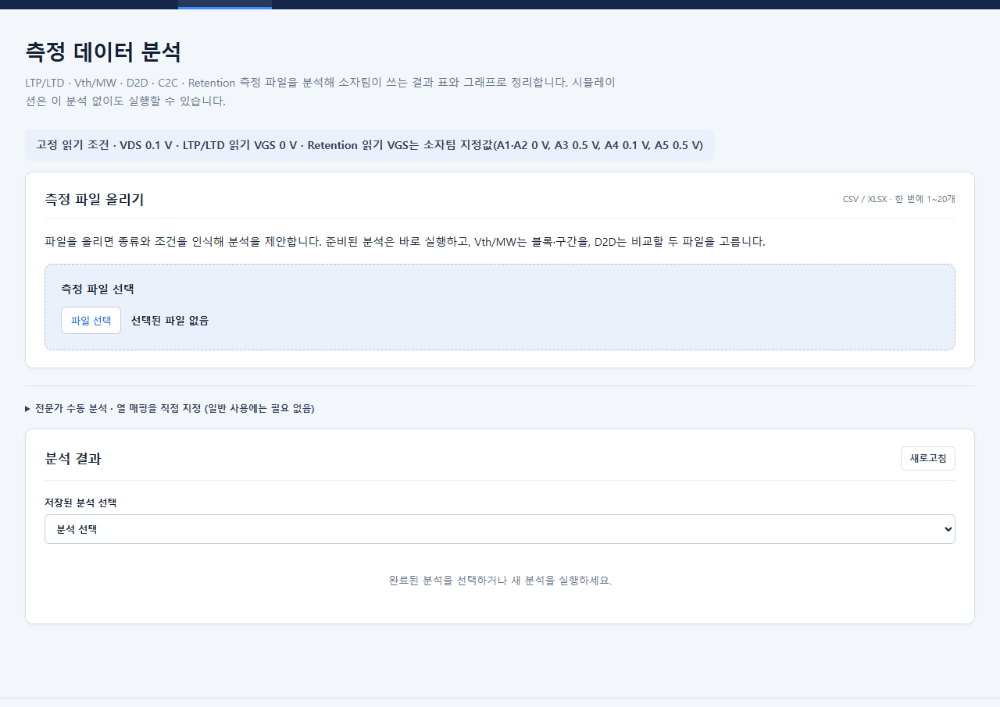

## 2. 공통 사용 순서 (모든 분석)

1. 상단 메뉴 **"측정 데이터 분석"** 을 누릅니다.
2. **"측정 파일 올리기"** 상자의 **`파일 선택`** 버튼을 누르면 Windows 파일 선택창이 열립니다. 폴더로 이동해 파일을 고르고 `열기`를 누릅니다. **여러 개를 한꺼번에 고를 수 있습니다**(CSV/XLSX, 한 번에 1~20개, 파일당 100 MiB 이하).
3. 잠시 뒤 **"인식 결과"** 에 파일마다 `종류 · 조건(A1~A5) · ready` 가 한 줄씩 나옵니다. `ready`가 아니면 그 줄을 펼쳐 이유를 읽습니다(예: 조건을 못 읽음).
4. 그 아래 **"분석 제안 · N개"** 에서 실행할 분석을 정합니다.
   - C2C, Retention, LTP/LTD: 이미 "준비됨"이라 따로 고를 것이 없습니다.
   - I–V: 카드마다 **체크박스**가 있습니다. 실행할 것만 체크합니다(3장).
   - D2D: 두 파일을 직접 고르고 `D2D 비교 제안 만들기`를 누릅니다(5장).
5. 파란 **`분석 N개 실행`** 버튼을 누릅니다. 화면 아래 "실행한 분석"에 진행 상태가 나옵니다.
6. 끝나면 **"분석 결과"** 패널에 결과가 나옵니다. 다른 결과를 보려면 **"저장된 분석 선택"** 드롭다운에서 고릅니다. (결과는 서버에 저장되어 서버를 껐다 켜도 남습니다.)
7. 결과 맨 아래의 **CSV·PNG 버튼**으로 내려받습니다. 파일 용도는 8장에 정리했습니다.

실제 파일 선택창으로 C2C 파일 5개(`A1~A5_C2C_50Cycles.xlsx`)를 한 번에 올린 화면입니다. 5개 모두 "C2C (반복 스윕) · 조건 · ready"로 인식됐습니다.

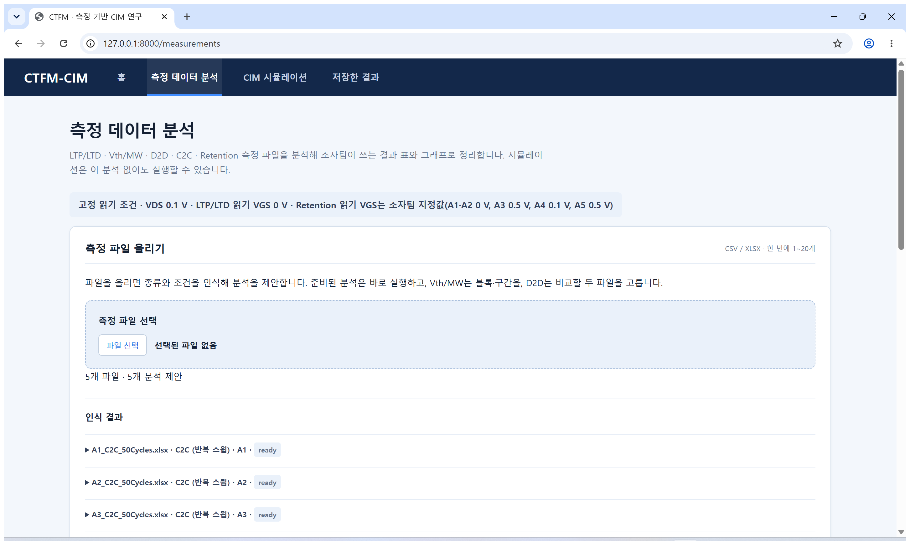

인식 결과 목록(5개 모두 `ready`):

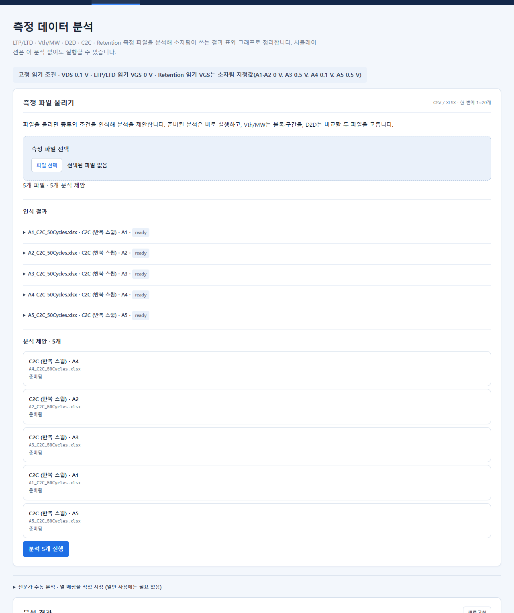

(위 캡처는 Windows의 Chrome에서 실제 파일 선택창을 열어 폴더 이동 → 5개 파일 입력 → `열기`로 올린 결과입니다. 이 PC에서 직접 확인했습니다.)

## 3. I–V (Vth / Memory Window)

### 무엇을 확인하나
게이트 전압(Vg)을 한 방향으로 올렸다가 내리면서 드레인 전류(Id)를 재면 **히스테리시스 곡선**이 나옵니다. 여기서 두 가지를 뽑습니다.

- **문턱전압 Vth (V)**: 전류가 기준값 **1 µA(= 1.0×10⁻⁶ A)** 에 도달하는 게이트 전압. 올리는 구간(erase)과 내리는 구간(program)에서 각각 하나씩 구합니다.
- **메모리 윈도우 MW (V)** = |Vth(program) − Vth(erase)|. 값이 클수록 두 상태가 잘 구분됩니다.

### 실제 파일과 묶는 기준
- 파일 하나 = **소자 하나의 I–V 스윕 한 번**입니다(예: `_26CTFM_A2_IdVg_sweep_233_15V.xlsx`). 파일 안에는 **블록 15개**(스윕 진폭 1 V, 2 V, … 15 V)가 있고, 한 블록은 `Vg, Id, Ig` 세 열입니다.
- 조건(A1~A5)은 **파일 이름 속 `A1`~`A5`** 로 정해집니다. 파일 이름에 조건 표시가 없거나 두 개가 섞여 있으면 인식 결과 줄에서 조건을 직접 고르게 합니다.
- 실제 파일 수: A1 13개, A2 8개, A3 8개, A4 10개, A5 11개 (`IV Sweep` 폴더 기준).
- 위로 올리는 구간 = **erase**, 아래로 내리는 구간 = **program**으로 읽습니다(프로젝트 규칙).

### 여러 파일을 올리는 방식
한 번에 여러 파일을 올릴 수 있고(최대 20개), **파일마다·블록(진폭)마다 후보 카드**가 만들어집니다. 카드 한 장은 *"같은 블록의 erase 구간 + program 구간 한 쌍"* 입니다. 이번 확인에서는 A2 파일 2개를 올리자 후보 60개가 만들어졌습니다(2파일 × 15블록 × 후보 2개).

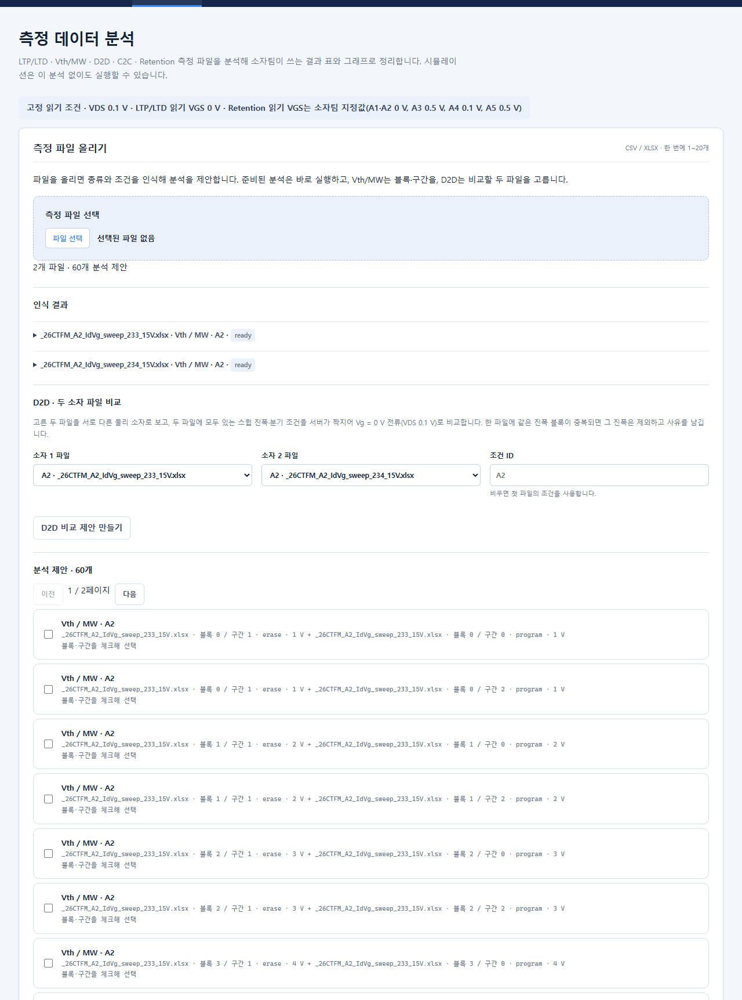

- **체크한 카드 하나마다 분석이 하나씩 따로 실행됩니다.** 각 분석은 "소자(파일) 1개 × 진폭 1개"의 Vth 2개와 MW 1개를 냅니다.
- 같은 블록에 **program 후보가 둘** 나옵니다. `구간 0`은 맨 처음 0 V → −A 반쪽 스윕, `구간 2`는 +A → −A 전체 내림 구간입니다. 화면은 **자동으로 고르지 않습니다.** 이 안내서의 예제는 D2D와 같은 정의(상승 직후 전체 내림)인 **구간 1 + 구간 2** 를 골랐습니다. 어느 쪽이 연구에 맞는지는 소자팀 확인 사항입니다.
- A3 파일은 처음 반쪽 스윕이 없어 블록당 후보가 하나입니다.


### 파일 수가 달라도 되나?
- **일반 화면(카드 체크)**: 분석이 서로 독립이라 소자 수·진폭 수가 달라도 됩니다. 체크한 만큼만 실행됩니다.
- **여러 소자를 묶어 평균·표준편차를 보고 싶을 때**: "전문가 수동 분석"(화면 중간의 접힌 항목) 요청이 필요합니다. 같은 진폭을 가진 소자가 둘 이상이면 진폭별 평균·표준편차가 나오고, 한 소자뿐이면 개수 `n=1`이고 표준편차는 `—`입니다. MW는 그 소자에 **erase·program Vth가 둘 다 유효할 때만** 계산됩니다. 이번에는 같은 요청을 **API로 직접 보내** A2 두 파일(233·234)의 5 V, 15 V를 묶어 확인했습니다(아래 표). *전문가 수동 분석 화면을 직접 눌러 조작한 것은 아닙니다(미확인).* 서로 다른 조건(A1~A5)을 한 분석에 섞는 것은 시도하지 않았습니다.

### 실제 결과 (A2, 파일 233·234, 구간 1+2)
| 파일 | 진폭 | Vth erase (V) | Vth program (V) | MW (V) |
|---|---:|---:|---:|---:|
| `…sweep_233_15V.xlsx` | 5 V | −3.5036 | −1.6796 | 1.8239 |
| `…sweep_233_15V.xlsx` | 15 V | −4.7492 | 2.9899 | 7.7391 |
| `…sweep_234_15V.xlsx` | 5 V | −3.0225 | −1.1062 | 1.9164 |
| `…sweep_234_15V.xlsx` | 15 V | −3.8737 | 4.0500 | 7.9237 |

두 소자를 묶은 전문가 요청(API)의 진폭별 평균 ± 표본 SD: 5 V에서 MW **1.8701 ± 0.0654 V**, 15 V에서 **7.8314 ± 0.1305 V** (n=2). 같은 파일에서 직접 따로 계산한 값과 일치했습니다.

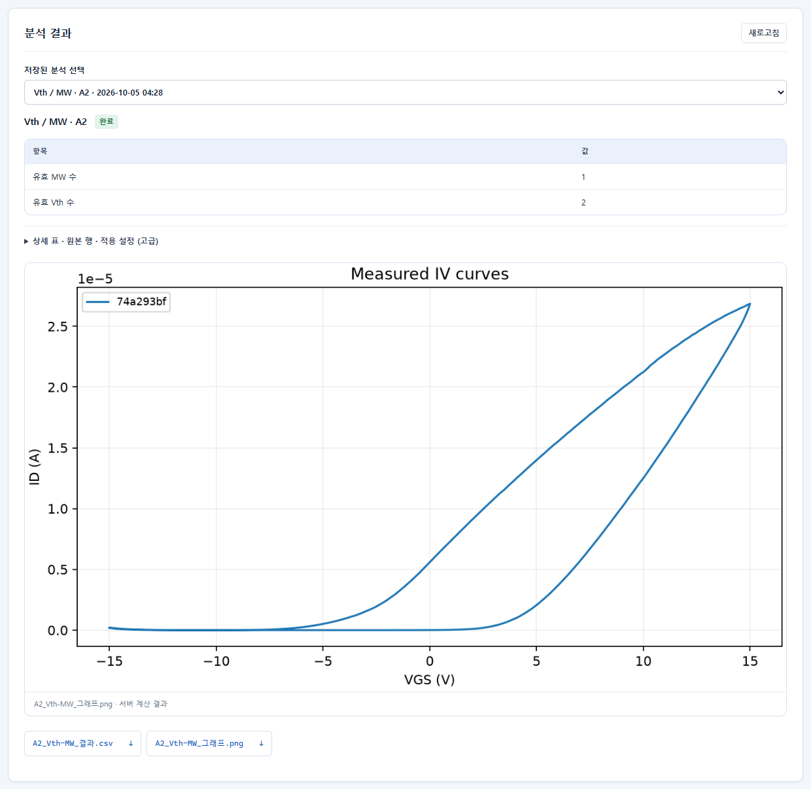

> **Vth/MW 숫자는 화면 기본 요약에 나오지 않습니다.** 기본 화면은 "유효 MW 수 / 유효 Vth 수"만 보여 줍니다. 숫자는 **`상세 표 · 원본 행 · 적용 설정 (고급)`** 을 펼치거나(아래 캡처), **CSV를 내려받아** 확인하세요.

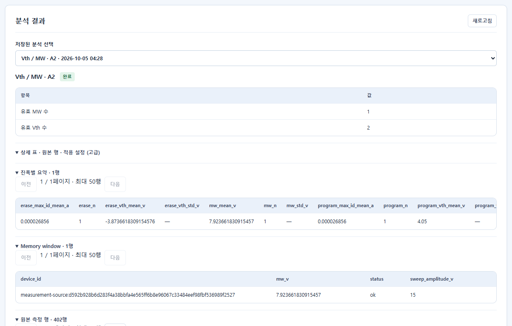

- **교차가 여러 번이면** 값을 억지로 고르지 않고 "모호"로 표시하고 Vth를 비웁니다. 교차가 없어도 같습니다.
- CSV의 "소자" 칸은 `measurement-source:` + 파일 해시입니다. **물리 소자 번호가 아닙니다.**

## 4. C2C (Cycle-to-Cycle) — 반복 측정의 흔들림

### 무엇을 확인하나
같은 소자에서 같은 스윕을 **50번 반복**하고, 매번 **Vg = 0 V일 때의 전류**를 읽어 그 값이 사이클마다 얼마나 변하는지를 %로 봅니다. 시뮬레이터의 "C2C 편차(%)" 칸에 넣을 후보값을 얻는 분석입니다.

### 실제 파일
`A1_C2C_50Cycles.xlsx` ~ `A5_C2C_50Cycles.xlsx` (각 1개, 위치 `data/team-snapshot/2026-10-03/files/C2C/`). 파일 하나에 시트 `Id_sweeps`(501개 전압 × 50개 사이클), `Cycle_reference`가 있습니다. **A1은 ±12 V, A2~A5는 ±15 V** 스윕입니다. 전압 경로는 `0 → −A → +A → −A` 입니다.

### 화면 사용법
1. `파일 선택`에서 C2C 파일을 고릅니다(한 번에 5개도 가능).
2. 인식 결과가 `C2C (반복 스윕) · A? · ready`면 `분석 N개 실행`을 누릅니다.
3. 결과에서 **"구간" 표**를 봅니다. 한 줄이 한 읽기 지점입니다.
   - **최초 0 V**: 스윕 맨 처음의 0 V (행 2)
   - **상승 중 0 V**: −A에서 +A로 올라가다 지나는 0 V (행 202)
   - **하강 중 0 V**: +A에서 −A로 내려가다 지나는 0 V (행 402)
   세 지점은 **서로 섞지 않고 따로** 계산합니다(올라갈 때와 내려갈 때, 처음 값은 성격이 다릅니다).
4. 각 줄에 **두 가지 값**이 있고 옆에 `복사` 버튼이 있습니다.
   - **전체 변동 CV** = 50개 값이 평균 대비 얼마나 퍼졌나. 시간에 따른 추세(점점 감소 등)도 *포함*됩니다.
   - **추세 제거 후 상대 잔차 SD** = 50개 값에 **직선 추세**를 맞추고, 그 직선에서 벗어난 정도(상대값)의 퍼짐.
5. 시뮬레이터에 쓸 값은 **하나만** 고릅니다. 그 줄의 `복사`를 누르고 시뮬레이터 프로필의 "C2C 편차 (%)" 칸에 붙여 넣습니다. (두 값을 한꺼번에 넣어 두 결과를 자동으로 만드는 기능은 없습니다. 전체 변동 값으로 한 번, 추세 제거 값으로 한 번 **각각 따로 실행**합니다 → [simulator-guide.md](simulator-guide.md))
6. 다운로드: `A?_C2C_결과.csv`, `A?_C2C_그래프.png`.

> **어느 구간(초기/상승/하강)을 대표값으로 쓸지는 아직 정해지지 않았습니다.** 소자팀이 쓰기 상태와의 대응을 확인한 뒤 정합니다. 앱은 **어느 것도 자동 선택하지 않습니다.** 작은 값을 얻으려고 구간을 고르면 안 됩니다. 이 안내서의 예제는 "상승 중 0 V"를 *예시로* 골랐을 뿐 연구적으로 승인된 값이 아닙니다.

### 실제 결과 (50개 전부 사용, 어떤 사이클도 제외하지 않음)
단위: 평균·SD는 µA, 변동은 %. "추세 제거"는 `추세 제거 후 상대 잔차 표준편차`.

| 조건 | 구간 (셀 범위) | 평균 (µA) | 표본 SD (µA) | 전체 변동 CV | 추세 제거 후 |
|---|---|---:|---:|---:|---:|
| **A1** (±12 V) | 최초 0 V (B2:AY2) | 32.008240 | 2.868652 | 8.962230 | 3.171725 |
| | 상승 중 (B202:AY202) | 36.546360 | 2.897948 | 7.929512 | 2.787384 |
| | 하강 중 (B402:AY402) | 13.936480 | 1.654207 | 11.869619 | 4.568632 |
| **A2** | 최초 0 V | 19.024840 | 0.681346 | 3.581349 | 2.337826 |
| | 상승 중 | 25.255400 | 1.534398 | 6.075524 | 2.917903 |
| | 하강 중 | 4.538944 | 0.113931 | 2.510084 | 2.492470 |
| **A3** | 최초 0 V | 50.283200 | 4.894926 | 9.734714 | 1.898242 |
| | 상승 중 | 70.928960 | 9.107711 | 12.840609 | 3.463368 |
| | 하강 중 | 5.782602 | 2.029701 | 35.100133 | 16.531713 |
| **A4** | 최초 0 V | 46.817720 | 4.974633 | 10.625534 | 2.939228 |
| | 상승 중 | 57.518280 | 7.170084 | 12.465748 | 3.701655 |
| | 하강 중 | 8.076758 | 1.180264 | 14.613091 | 14.955397 |
| **A5** | 최초 0 V | 11.397904 | 1.832934 | 16.081324 | 6.491459 |
| | 상승 중 | 16.128926 | 3.382270 | 20.970215 | 14.440904 |
| | 하강 중 | 0.151242 | 0.023622 | 15.618871 | 12.397612 |

위 15개 값은 앱 화면·CSV 값과 **원본 파일에서 따로 계산한 값이 일치**합니다(차이 2×10⁻¹⁴ %p 이하).

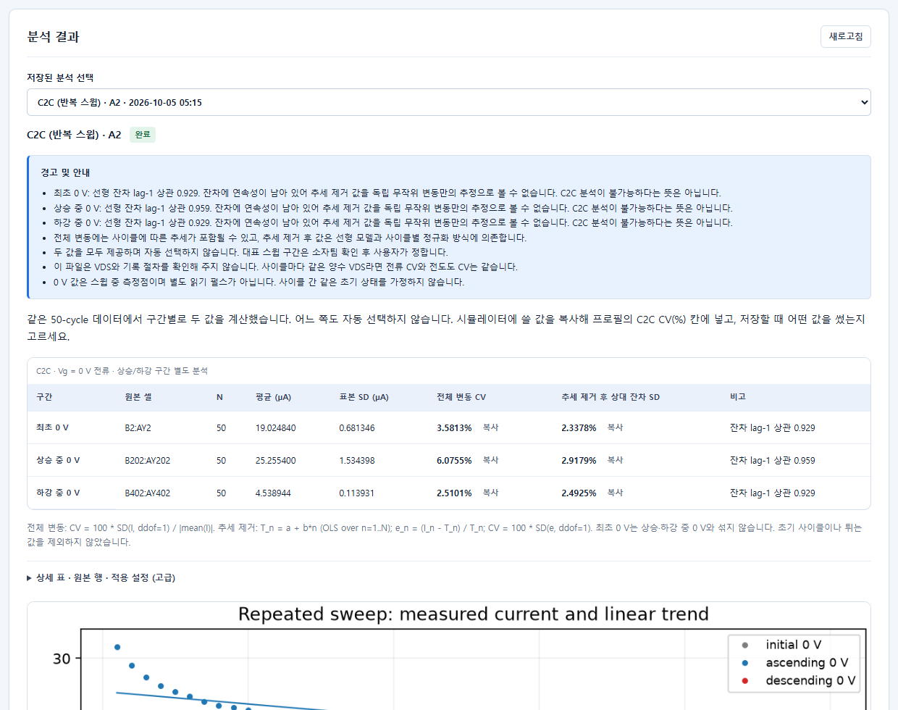

읽는 법과 주의:
- 같은 구간에서 **추세 제거 값이 전체 변동보다 훨씬 작으면**(예: A3 하강 35.1 → 16.5) 흔들림의 상당 부분이 "점점 변하는 추세"라는 뜻입니다. **그 추세가 열화인지, 진짜 무작위 변동인지는 이 데이터만으로 구분할 수 없습니다.**
- **추세 제거 값이 전체 변동보다 *크게* 나오기도 합니다**(A4 하강: 14.96 vs 14.61). 이상값이 직선 맞춤 자체를 흔들기 때문입니다. 값이 작다고 더 좋은 추정이라는 뜻이 아닙니다.
- "잔차 lag-1 상관"이 1에 가까우면(A2는 0.93~0.96) 추세를 뺀 뒤에도 **연속성이 남아 있다**는 뜻입니다. 분석이 틀렸다는 뜻이 아니라, 추세 제거 값을 *"독립 무작위 변동만의 값"* 이라고 주장할 수 없다는 뜻입니다. 화면 위쪽 "경고 및 안내"에 같은 내용이 적힙니다.
- 이 파일은 측정할 때의 VDS와 쓰기 절차를 알려주지 않습니다. VDS가 사이클마다 같은 양수이면 전류의 CV와 전도도의 CV는 같습니다.
- 0 V 값은 스윕 **도중의 측정점**이지 따로 한 읽기 펄스가 아닙니다.

### A4·A5의 특이한 값 (제외하지 않음)
| 파일 | 어디 | 값 | 비고 |
|---|---|---|---|
| A4 | 하강 중 0 V, **사이클 3** | 3.5×10⁻¹³ A (0.00000035 µA) | 나머지 49개는 7.32~8.43 µA. **분석에 그대로 포함** |
| A5 | 상승 중 0 V, **사이클 11** | 1.848 µA | 나머지 49개는 13.76~23.94 µA. **분석에 그대로 포함** |
| A5 | 사이클 11의 **스윕 끝부분** | 원본 행 **499~502의 4칸이 비어 있음** | 아래 설명 |

**A5 사이클 11의 빈 칸 4개와 "분석 대상 0 V 값"은 별개입니다.** 비어 있는 곳은 +A → −A 내림 스윕의 *마지막 4개 지점*(행 499~502)이고, 분석에 쓰는 0 V 값은 **행 2·202·402**에 있으며 사이클 11에도 값이 있습니다. 그래서 세 구간 모두 50개 값이 계산에 쓰였습니다. 앱은 빈 칸을 **채우거나 사이클을 빼지 않고**, 결과 위쪽 "경고 및 안내"에 *"Cycle_11: 원본 행 499-502의 4칸이 비어 있습니다. 분석 대상 0 V 행이 아니어서 세 구간의 계산에는 쓰이지 않았고, 값을 채우거나 사이클을 제외하지 않았습니다."* 라고 알립니다. (분석 대상 0 V 행 자체가 비어 있으면 그 구간은 계산하지 않고 위치를 알려 줍니다.)

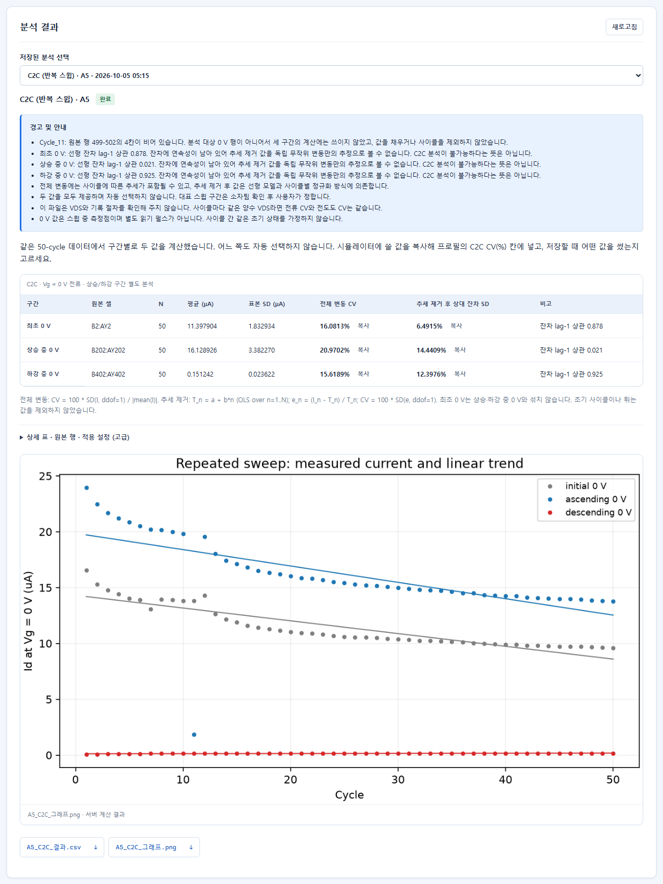

A4 결과도 같은 방식입니다(이상값을 빼지 않음). 아래는 A4 화면입니다.

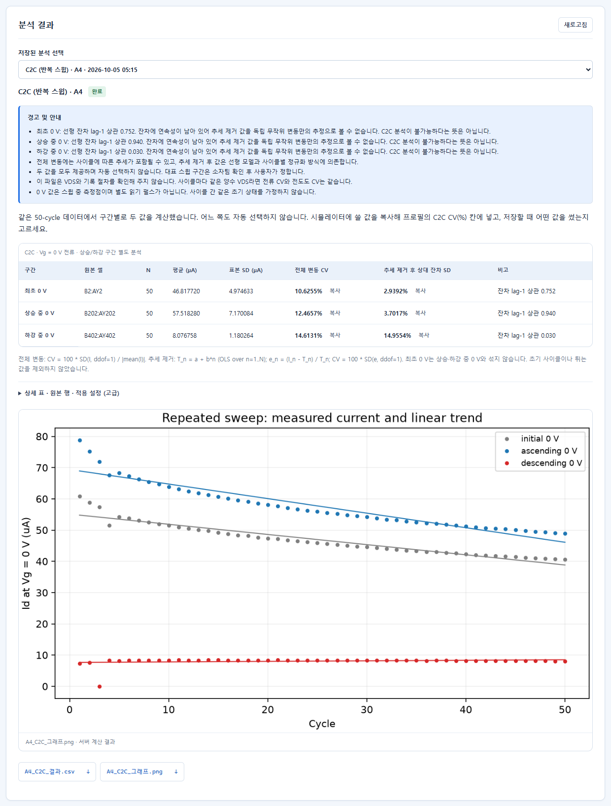

나머지 조건의 화면: [A1 (±12 V)](assets/ma-11-c2c-A1.png) · [A3](assets/ma-12-c2c-A3.png)

## 5. D2D (Device-to-Device) — 두 소자의 차이

### 무엇을 확인하나
**서로 다른 두 소자**의 전도도를 같은 조건끼리 비교해 소자 간 편차(%)를 구합니다. 시뮬레이터의 "D2D 편차 (%)" 칸에 넣을 값을 얻습니다.

### 실제 파일 (조건마다 지정된 두 파일)
`D2D/A?/` 폴더에 조건마다 **지정된 파일이 딱 두 개**씩 있습니다. 파일 번호를 물리 소자 번호로 해석하지 않고 "선택한 두 파일"로만 취급합니다.

| 조건 | 파일 1 | 파일 2 |
|---|---|---|
| A1 | `_26CTFM_A1_vgid_sweep_200_15V.xlsx` | `…201_15V.xlsx` |
| A2 | `_26CTFM_A2_IdVg_sweep_233_15V.xlsx` | `…234_15V.xlsx` |
| A3 | `_26CTFM_A3_vgid_sweep_245_15V.xlsx` | `…246_15V.xlsx` |
| A4 | `_26CTFM_A4_IdVg_sweep_232_15V_.xlsx` | `…233_15V.xlsx` |
| A5 | `_26CTFM_A5_IdVg_sweep_223_15V_.xlsx` | `…224_15V.xlsx` |

### 화면 사용법
1. `파일 선택`으로 **그 조건의 두 파일**을 함께 올립니다. 각각 "Vth / MW · A? · ready"로 인식됩니다.
2. "D2D · 두 소자 파일 비교" 상자에서 **소자 1 파일**, **소자 2 파일**을 드롭다운으로 각각 고릅니다. (같은 파일을 두 번 고르면 오류가 납니다.) **조건 ID**는 비워 두면 첫 파일의 조건을 씁니다.
3. **`D2D 비교 제안 만들기`** 를 누릅니다. 목록 맨 끝(마지막 페이지)에 `D2D · A2 … 대응 조건 30개 · 준비됨` 카드가 추가됩니다. 이 카드는 체크할 필요 없이 바로 실행 대상입니다.
4. `분석 N개 실행`을 누릅니다. 위 2장의 화면과 같은 상자가 사용됩니다.

### 계산 기준
- 파일 하나에는 진폭 1~15 V 블록이 있습니다. 두 파일에서 **같은 (진폭, 분기) 조건끼리** 짝을 짓습니다. 분기는 erase(올리는 구간), program(올린 직후 +A→−A 전체 내림 구간)입니다. 15진폭 × 2분기 = **조건 30개**.
- 조건마다 **Vg = 0 V일 때의 전류**를 읽어 `G = Id / 0.1 V`(전도도, S)를 구하고, 두 소자의 표본 표준편차를 평균으로 나눈 **CV_k**를 구합니다.
- 대표값 = **RMS** = √(CV₁² + … + CV_K²) / √K 형태로 조건별 CV를 제곱평균합니다. 이것은 이 프로젝트가 정한 요약 방식이며 "유일한 표준 식"이 아닙니다. 결과는 **두 소자 기준 대표 편차**이지 소자 집단의 분포를 확정한 값이 아닙니다.
- 같은 진폭 블록이 한 파일에 **두 개 중복**이면 어느 쪽이 맞는지 알 수 없어 **그 진폭(erase·program 둘 다)을 제외**하고 이유를 남깁니다.

### 실제 결과 (A1~A5, 앱에서 실행 → 원본에서 따로 계산한 값과 비교)
| 조건 | 유효 조건 수 K | 대표 D2D CV (RMS) | 비고 |
|---|---:|---:|---|
| A1 | 30 | **16.2179 %** | |
| A2 | 30 | **47.3534 %** | 조건별 30개 CV 전부 일치 |
| A3 | 30 | **64.7417 %** | |
| A4 | 30 | **22.8755 %** | |
| A5 | 28 | **17.9573 %** | 224 파일에 11 V 블록이 2개 있어 11 V(erase·program) 제외 |

앱 값과 독립 계산 값의 차이는 모두 1.4×10⁻¹⁴ %p 이하입니다. A5의 11 V 두 블록은 값이 서로 달라(erase 전류 50.33 / 48.43 µA, program 22.39 / 22.52 µA) 임의로 한쪽을 고르지 않았습니다. 어느 쪽을 쓰든 그 조건의 CV는 13~17 % 범위라 대표값에 미치는 영향은 작습니다.

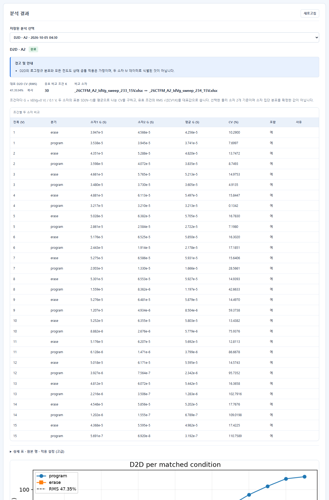

- 조건별 CV는 **program 분기에서 진폭이 클수록 크게 늘어납니다**(A2: 1 V 7.7 % → 15 V 110.8 %). 대표값은 이 모든 조건의 제곱평균이라 큰 진폭의 영향이 큽니다.

## 6. Retention — 시간에 따른 전류 변화

### 무엇을 확인하나
쓰기(erase / program) 직후부터 **1000초까지 실제로 잰 전류**가 시간이 지날수록 어떻게 줄거나 늘어나는지 보고, 그 추세를 **10년까지 연장(외삽)** 해 봅니다.

### 실제 파일
`Retention/_26CMFM_A1_Retention.xlsx` ~ `…A5_Retention.xlsx` (조건당 1개). 시트 `Raw Data`의 **원본 전류**(규격화한 시트 `Normalized Data`가 아님)를 씁니다. 시간 10초 이상 100개 점.

### 화면 사용법
`파일 선택` → "Retention · A? · ready" → `분석 N개 실행` → 결과. 다운로드: `A?_Retention_결과.csv`, `A?_Retention_그래프.png`.

### 결과를 읽는 법 — 실측과 외삽을 꼭 구분하세요
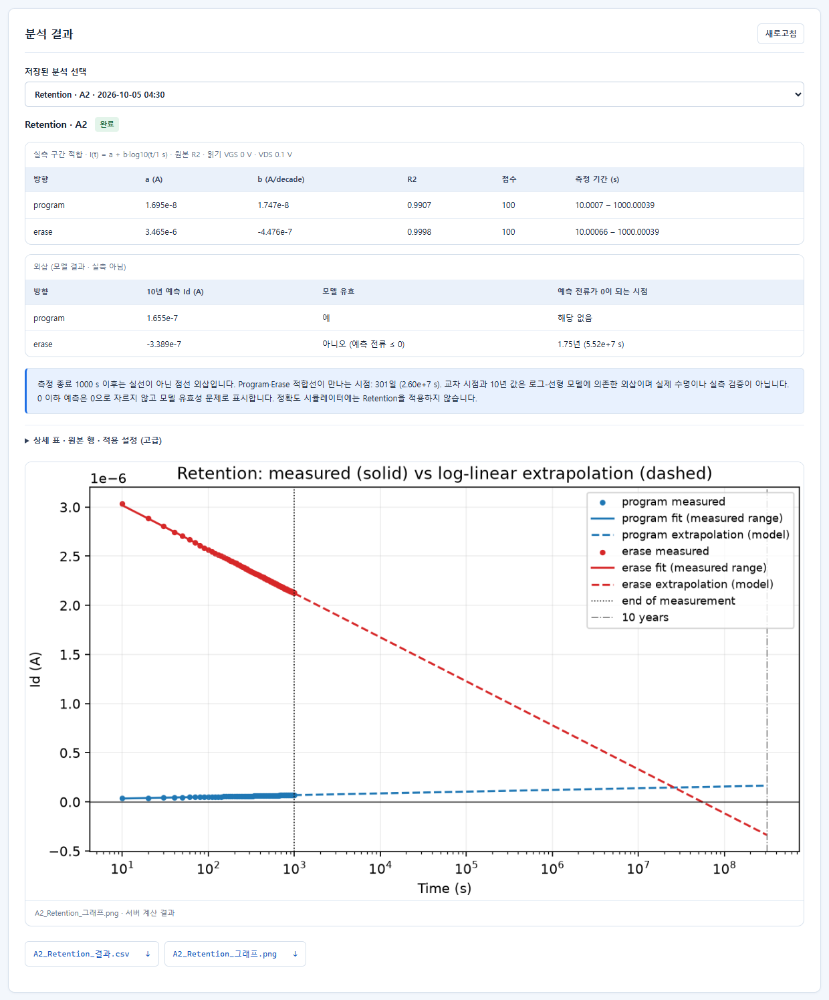

- **실측 구간 적합** 표: 측정한 10~1000 s 점에 `I(t) = a + b·log10(t/1 s)` 직선을 맞춘 계수(`a` A, `b` A/decade), 설명력 R², 점 수, 측정 기간. (표의 `R2`라는 이름은 맞춤의 R²이고, 제목의 "원본 R2"는 원본 데이터 라벨입니다.)
- **외삽** 표(제목에 **"모델 결과 · 실측 아님"**): 같은 직선을 **10년(3.15576×10⁸ s)** 까지 늘린 값. 그래프에서 **실선=실측 구간, 점선=외삽**, 세로 점선이 측정 종료(1000 s)와 10년입니다.
- 예측 전류가 0 이하가 되면 **0으로 자르지 않고** "모델 유효 아님 (예측 전류 ≤ 0)"으로 표시하고, 0이 되는 시점을 알려 줍니다.
- Program·Erase 직선이 만나는 시점(윈도우가 닫히는 시점)도 같은 모델에 의존한 값입니다.
- **한계**: 10년 값과 교차 시점은 로그-선형 모델의 연장일 뿐 **실제 수명이나 실측 검증이 아닙니다.** 측정은 1000초까지입니다.
- **정확도 시뮬레이터에는 Retention을 적용하지 않습니다.** 시뮬레이터에 Retention 입력 칸이 없고, 서버도 Retention을 켠 요청을 거절합니다(확인함). 이 분석은 보고용입니다.

### 실제 결과 (5개 조건, 앱 결과 = 원본 독립 계산 값)
| 조건 | 10년 Program (A) | 10년 Erase (A) | Erase 전류 0 도달 | Program·Erase 직선 교차 |
|---|---:|---:|---|---|
| A1 | 3.682×10⁻⁶ | 9.625×10⁻⁷ | 162년 | 18.9일 |
| A2 | 1.655×10⁻⁷ | **−3.389×10⁻⁷** (모델 유효 아님) | 1.75년 | 301일 |
| A3 | 1.617×10⁻⁵ | **−8.937×10⁻⁶** (모델 유효 아님) | 83.4일 | 0.693일 |
| A4 | 7.740×10⁻⁶ | 1.097×10⁻⁵ | 1714년 | 38.65년 |
| A5 | 8.023×10⁻⁸ | **−2.825×10⁻⁷** (모델 유효 아님) | 313.5일 | 173.8일 |

(A2 화면의 계수: program a = 1.695×10⁻⁸, b = 1.747×10⁻⁸ A/decade, R² 0.9907 / erase a = 3.465×10⁻⁶, b = −4.476×10⁻⁷, R² 0.9998.) 5개 조건 모두 앱(API+worker)에서 실행했고, 10년 값·0 도달 시점·교차 시점이 원본에서 따로 계산한 값과 일치했습니다. 화면 캡처는 A2만 실었습니다.

## 7. LTP / LTD 상태 (선택 분석)

시뮬레이터는 LTP/LTD 파일을 **직접** 받으므로 이 분석은 꼭 필요하지 않습니다. 파일에서 어떤 전도도 상태가 뽑히는지 미리 보고 싶을 때 씁니다.

- 파일: `LTD,LTP/A2/A2_LTP.csv`, `A2_LTD.csv` (두 개를 함께 올림 → "LTP / LTD 상태 · A2 · ready" 두 줄).
- 읽는 규칙: **쓰기 펄스 바로 직전의 읽기 값**(VGS ≈ 0 V)을 한 상태로 보고, `G = Id / 0.1 V`로 전도도로 바꿉니다. 6.0 s 이후부터.
- A2 결과: LTP 510개 + LTD 510개 = **후보 1020개, 모두 양의 전도도**. 결합 풀 Gmin 4.95 µS ~ Gmax 38.0 µS, 두 방향이 겹치는 구간(common)은 31개(7.75~12.3 µS). 제외 4건(시작 시각 이전 2, 마지막 읽기 구간 2).
- 앱이 만든 상태값은 원본 CSV에서 따로 뽑은 값과 **완전히 같았습니다**(전도도 차이 0.0 S).

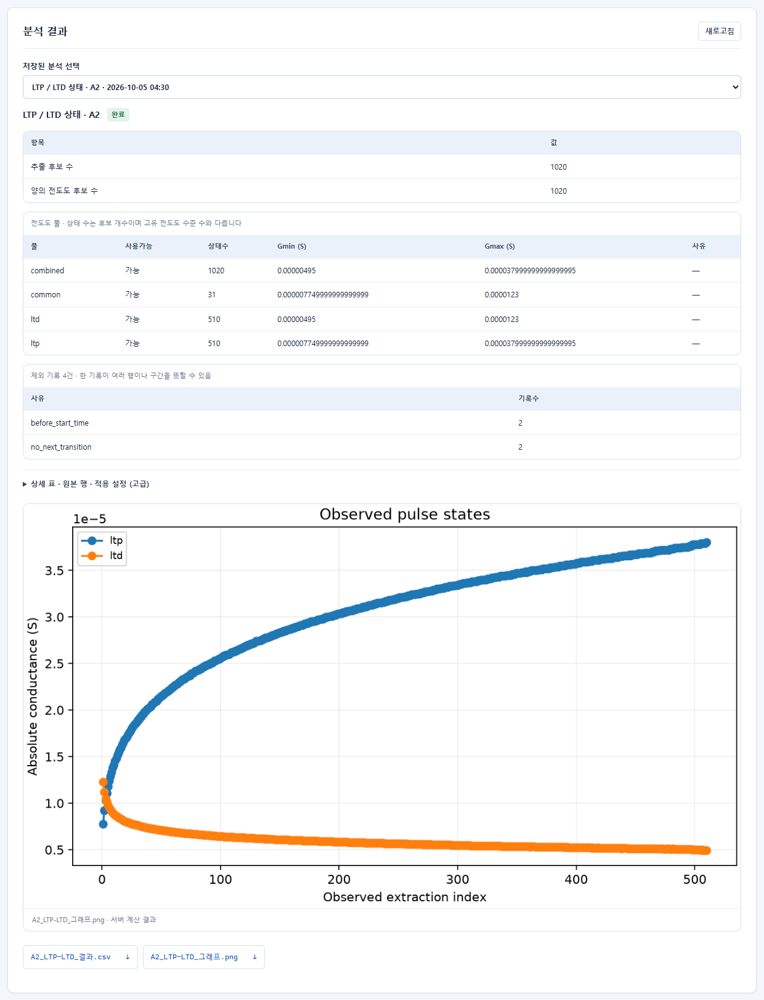

## 8. 다운로드 파일 — 용도와 내용

분석마다 **사용자용 파일은 2개(CSV, PNG)** 입니다. 내부 재현용 파일(요약 JSON, 로그 등)은 화면 목록에 나오지 않습니다.

| 분석 | CSV 이름 | CSV에 들어 있는 것 | PNG |
|---|---|---|---|
| I–V | `A?_Vth-MW_결과.csv` | 구분(Vth/MW), 소자(파일 해시), 진폭 V, 분기, Vth V, 상태, MW V | 측정한 I–V 곡선 |
| C2C | `A?_C2C_결과.csv` | 구간, 원본 셀 범위, 사이클 수, 평균 전류 µA, 표본 SD µA, 전체 변동 CV %, 추세 제거 후 상대 잔차 SD %, 선형 추세 기울기, 잔차 lag-1, 상태, 계산식 문구, 원본 파일명 | 사이클별 전류와 직선 추세 |
| D2D | `A?_D2D_결과.csv` | 진폭, 분기, 소자 1·2 이름·파일·Id@0 V·G, 평균 G, 표본 SD, CV %, 포함 여부, 제외 사유 (조건 30줄) | 조건별 CV와 RMS |
| Retention | `A?_Retention_결과.csv` | 구분(실측/외삽), 방향, 시간 s, 측정 Id, 적합 Id, 모델 유효, 시간(년) — 약 290줄 | 실측(실선)·외삽(점선) 그래프 |
| LTP/LTD | `A?_LTP-LTD_결과.csv` | 방향, 추출 순서, 원본 행, 시간, Id, G, 채택, 제외 사유 — 1020줄 | 상태 그림 |

- CSV는 Excel에서 열 수 있게 한글이 깨지지 않는 UTF-8(BOM)입니다.
- 위 PNG의 제목·범례는 영어입니다(그래프 글꼴 제한). 화면 문구와 CSV는 한국어입니다.

## 9. 근거 (전문 내용)

### 9-1. 계산식
```text
C2C 전체 변동     CV = 100 · SD(I, N−1) / |mean(I)|                         N = 50
C2C 추세 제거     T_n = a + b·n  (n = 1..50, 최소제곱 직선) ; e_n = (I_n − T_n) / T_n
                  CV = 100 · SD(e, N−1)       ※ 모든 T_n > 0 일 때만 계산
                  (회귀 잔차 SD  sqrt(Σ r² / (N−2)) / mean  은 다른 정의이며 쓰지 않음)
D2D 조건 k        G = Id(Vg = 0 V) / 0.1 V ; CV_k = |G1 − G2| / √2 / mean(G1, G2)
D2D 대표값        CV_D2D = sqrt( Σ CV_k² / K )
Vth               Id = 1 µA 를 가로지르는 두 인접 점 사이 선형 보간 (정확히 1 µA 인 점이면 그 값)
MW                |Vth(program) − Vth(erase)|
Retention         I(t) = a + b·log10(t / 1 s), t ≥ 10 s, 최소제곱 → 10년까지 외삽
LTP/LTD 상태      G = Id / VDS , VDS = 0.1 V
```

### 9-2. 독립 검산 (앱을 쓰지 않고 원본 파일에서 직접 계산)
| 항목 | 방법 | 결과 |
|---|---|---|
| C2C A1~A5 (15값) | `openpyxl`+표준 라이브러리로 행 2/202/402 읽어 위 식 적용 | 앱과 일치 |
| D2D A1~A5 | 블록·구간·0 V 교차를 따로 구현 | 앱과 일치 |
| Vth/MW 4건 | 1 µA 교차 보간을 따로 구현 | 앱과 일치 |
| Retention 5조건 | 최소제곱 직접 계산 | 앱과 일치 |
| LTP/LTD 상태 | 쓰기 직전 읽기 샘플을 따로 추출 | 앱과 완전 일치 |

계산 스크립트와 결과 JSON: `local_report/33-evidence/` (`recompute_*.py`, `*_independent.json`). 이 폴더는 git에 올라가지 않는 로컬 보관본입니다.

### 9-3. 내부 경로
- 분석 코드: `packages/ctfm-core/src/ctfm/measurement/` (`c2c_sweep.py`, `__init__.py`, `layouts.py`, `recognition.py`)
- 화면: `apps/web/src/pages/measurements/`
- 측정 원본 사본: `data/team-snapshot/2026-10-02/`(I–V·D2D·Retention·LTP/LTD·C2C A2), `data/team-snapshot/2026-10-03/`(C2C A1~A5; A2는 10-02와 동일 파일)
- 앱에서 쓴 서버 주소: `http://127.0.0.1:8000`
