# 시뮬레이터 사용법과 실제 실행 예제

화면 이름: **CIM 시뮬레이션** (`http://127.0.0.1:8000/simulator`).
측정한 LTP/LTD 전도도 상태로 신경망(MNIST 손글씨 인식, MLP) 가중치를 옮겨 놓았을 때 **인식 정확도가 얼마나 되는지**, 그리고 소자 편차(C2C·D2D)와 ADC를 켜면 **얼마나 떨어지는지**를 비교하는 화면입니다.
이 문서의 숫자는 모두 **이 PC에서 실제 AIHWKit 엔진으로 실행한 결과**입니다. 식과 내부 조건은 맨 아래 **8장(근거)** 에 모았습니다.

## 1. 먼저 알아둘 것

- **측정 분석을 먼저 하지 않아도 됩니다.** LTP/LTD 파일만 올리면 바로 실행됩니다. (분석 기록을 "연결"하는 칸이 없습니다.)
- 모델·크기는 **고정**입니다: MNIST · MLP(784-128-10) · 64×64 배열. 화면에서 바꿀 수 없습니다. 엔진은 항상 **AIHWKit**(실제 엔진)이며, 쓸 수 없으면 다른 엔진으로 몰래 바꾸지 않고 **실행을 막고 이유를 보여 줍니다**(local-run-guide 6장).
- C2C·D2D 편차는 **카드마다 숫자 하나씩 직접 입력**합니다. 숫자는 [측정 분석](measurement-analysis-guide.md)의 C2C·D2D 결과에서 가져옵니다.
- 이 화면은 Retention(시간에 따른 열화)을 **다루지 않습니다.**

## 2. 준비물

| 필요한 것 | 예제에서 쓴 실제 파일/값 |
|---|---|
| 소자 이름 | `A2` (마음대로 정하는 이름, 결과 표에 그대로 나옴) |
| LTP 파일 | `data/team-snapshot/2026-10-02/files/LTD,LTP/A2/A2_LTP.csv` |
| LTD 파일 | `data/team-snapshot/2026-10-02/files/LTD,LTP/A2/A2_LTD.csv` |
| C2C 편차(%) *(켤 때만)* | 측정 분석 C2C 결과 표의 한 칸. 예제: A2 "상승 중 0 V" 줄의 **전체 변동 6.0755**, **추세 제거 후 2.9179** |
| D2D 편차(%) *(켤 때만)* | 측정 분석 D2D 결과의 대표 CV. 예제: A2 쌍 **47.3534** |

- LTP와 LTD는 **같은 조건에서 잰 한 쌍**이어야 합니다. 두 파일을 한 쌍으로 인식하지 못하면 카드에 오류가 뜹니다(아래 4-4).
- 다른 조건(A3 등)의 값을 A2 카드에 넣지 마세요. 앱은 A2의 숫자를 다른 조건 값으로 자동으로 채우지 않습니다.

## 3. 화면 구성 한눈에


1. **디바이스 프로필** (위): 카드를 가로로 늘어놓는 영역. 카드 하나가 소자 하나. 카드가 많아지면 이 영역 안에서 **가로로 스크롤**됩니다. 맨 끝 `+ 프로필 추가`로 카드를 더합니다.
2. **공통 실행 설정** (가운데): 모든 카드에 똑같이 적용되는 조건.
3. **`시뮬레이션 실행 →`** (아래): 누르면 진행 화면으로 이동합니다. 그 아래 `이 임시 작업 폐기`.
4. 오른쪽 위 **"자동 저장됨"**: 입력은 바꿀 때마다 자동 저장되어, 새로고침해도 이어서 할 수 있습니다.

### 카드의 항목
| 항목 | 설명 |
|---|---|
| 소자 이름 | 필수. 결과의 이름으로 쓰입니다. |
| LTM 파일 · LTP 파일 / LTD 파일 | 각각 `파일 선택`으로 올립니다. 올리면 파일 이름과 **"업로드 완료"** 만 보입니다. |
| C2C 편차 (%) | 공통 설정에서 **C2C를 켰을 때만** 입력 가능. 꺼져 있으면 `미사용`. |
| D2D 편차 (%) | 공통 설정에서 **D2D를 켰을 때만** 입력 가능. |
| 삭제 | 이 카드를 지웁니다. |

### 공통 실행 설정
| 항목 | 의미 | 기본값 | 선택 범위 |
|---|---|---|---|
| ADC 양자화 | 아날로그 전류를 디지털 수로 바꾸는 장치의 해상도를 반영할지 | **켜짐** | 켜짐/꺼짐 |
| ADC 비트 | ADC가 쓰는 비트 수. 낮을수록 정확도가 많이 떨어짐 | **5 bit** | 3~8 bit |
| D2D 편차 반영 | 소자마다 다른 특성(편차)을 반영할지 | **꺼짐** | 켜짐/꺼짐 |
| 배열 생성 수 | D2D를 켰을 때, 서로 다른 무작위 배열을 몇 개 만들어 평균낼지 | 1 | 1~100 |
| C2C 편차 반영 | 쓸 때마다 달라지는 흔들림을 반영할지 | **꺼짐** | 켜짐/꺼짐 |
| 재기록 횟수 | C2C를 켰을 때, 다시 쓰는 횟수(매번 새 무작위)를 몇 번 평균낼지 | 1 | 1~100 |

- D2D/C2C는 **기본 꺼짐**입니다. 카드의 편차 칸은 켜진 항목만 필요합니다. 꺼진 항목의 칸은 비워 두어도 실행을 막지 않습니다.
- 켜져 있는데 해당 카드의 값이 비어 있으면 카드에 **"C2C가 켜져 있어 C2C CV(%)가 필요합니다."** 가 뜨고 실행 버튼이 비활성화됩니다. 숫자 **0은 입력한 값으로 인정**되고, 빈칸과 구별됩니다.
- 배열 수·재기록 횟수가 클수록 오래 걸립니다(예: 재기록 5회 약 3분, 이 PC 기준).
- 이 밖에 **고정된 조건**(화면에서 선택 불가): 입력 8 bit, ADC 방식·범위, 난수 시드, 모델 가중치(실행마다 같은 방식으로 다시 학습해 같은 가중치가 나옴), 각 카드의 전도도 풀(LTP+LTD 전체)과 매핑 방식.

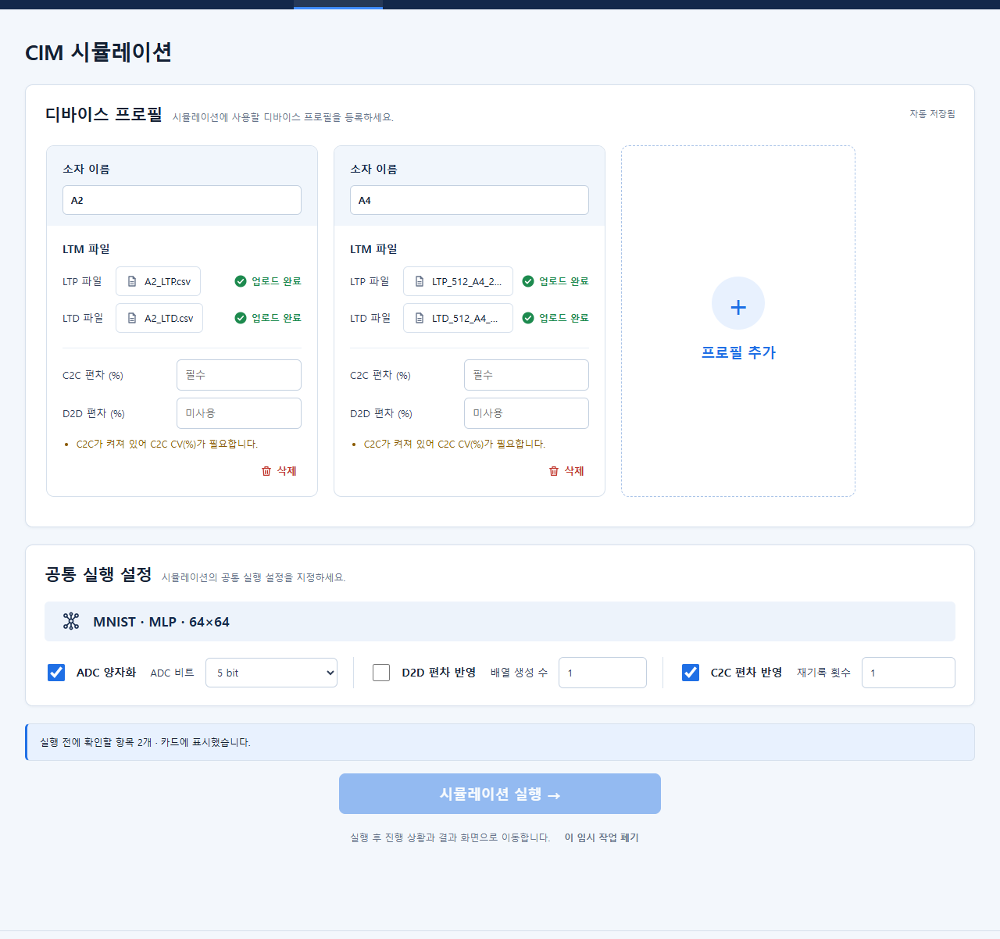

## 4. 따라 하기

### 4-1. 새 시뮬레이션 시작
상단 메뉴 **"CIM 시뮬레이션"** → **`새 시뮬레이션`**.

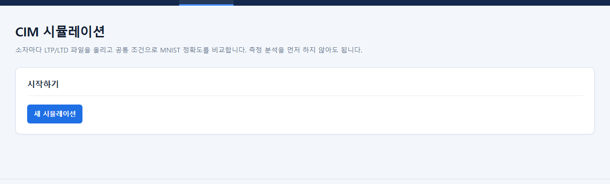

`새 시뮬레이션`을 누르면 빈 입력 화면이 열립니다(카드 1개가 미리 만들어져 있음).

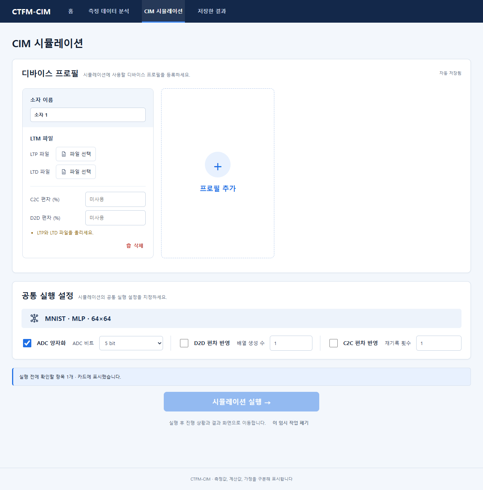

### 4-2. 프로필 카드 채우기
1. **소자 이름**에 `A2` 입력.
2. **LTP 파일 `파일 선택`** → `A2_LTP.csv`, **LTD 파일 `파일 선택`** → `A2_LTD.csv` 선택. 몇 초 뒤 두 줄 모두 **"업로드 완료"** 가 됩니다(두 파일을 한 쌍으로 인식하고 전도도 상태를 뽑는 단계가 자동으로 지나갑니다).
3. 공통 설정은 기본값(ADC 켜짐 5 bit, D2D·C2C 꺼짐) 그대로 두면 **C2C OFF 기준 실행**이 됩니다.

### 4-3. C2C·D2D 편차 입력 (켜는 방법)
- **C2C**: 공통 설정의 **"C2C 편차 반영"** 을 켜고 **재기록 횟수**(예: 5)를 정한 뒤, 카드의 **"C2C 편차 (%)"** 에 숫자를 입력합니다.
- **D2D**: **"D2D 편차 반영"** 을 켜고 **배열 생성 수**(예: 3)를 정한 뒤 카드의 **"D2D 편차 (%)"** 에 입력합니다.

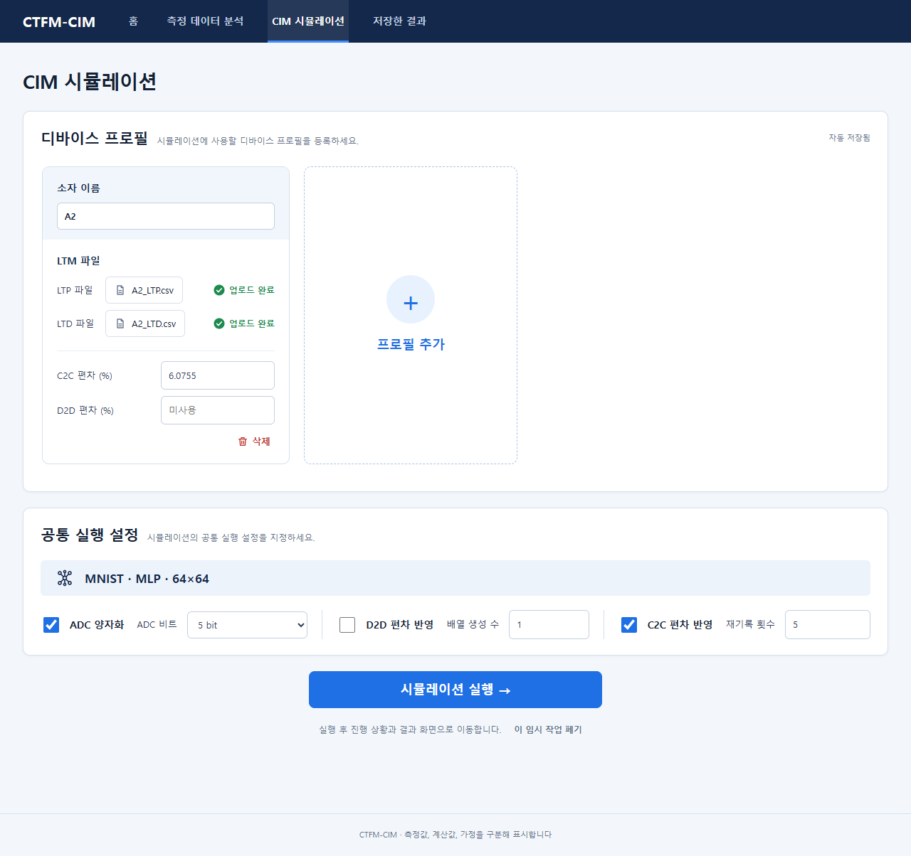

D2D를 켠 입력 화면(예제 4: D2D 47.3534, 배열 생성 수 3):

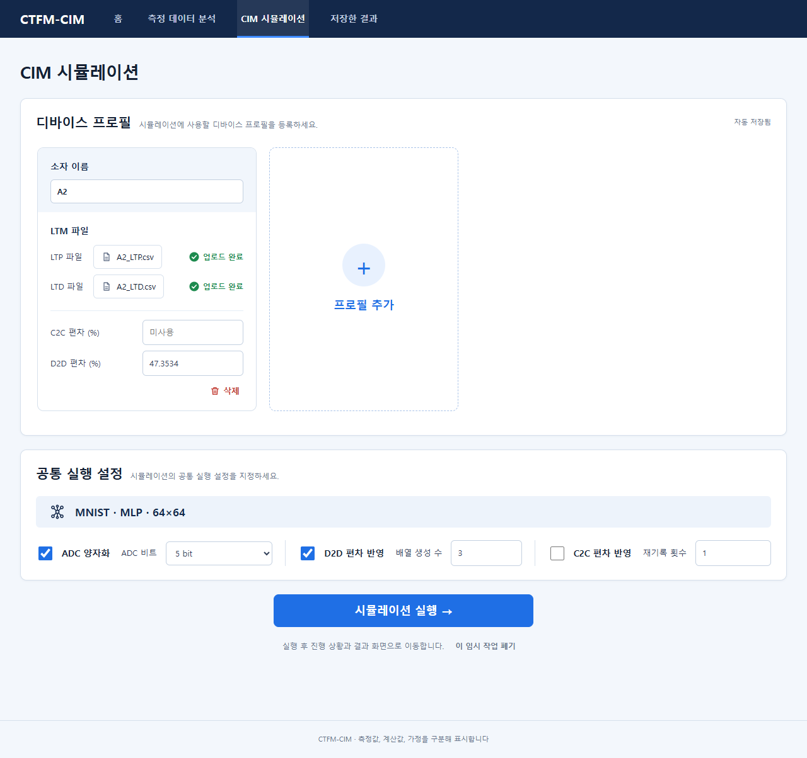

**전체 변동과 추세 제거 후 변동은 한 번에 하나씩 따로 실행합니다.** 칸이 하나뿐이므로, 전체 변동 값(6.0755)으로 한 번 실행하고, 추세 제거 후 값(2.9179)으로 다시 실행해 비교합니다. 두 번째 실행은 **`설정 복제해 새 시뮬레이션`** 으로 같은 파일·같은 설정을 가져와 값만 바꾸는 것이 가장 쉽습니다(4-8).

> 위 두 값은 *예시로 고른* A2 "상승 중 0 V" 구간의 것입니다. 대표 구간은 아직 정해지지 않았으며 이 값은 **연구적으로 승인된 대표값이 아닙니다.**

### 4-4. 프로필 추가 · 삭제 · 일부 파일 교체
- **추가**: 카드 영역 맨 끝 `+ 프로필 추가`. 새 카드로 **자동으로 이동하고 이름 칸에 커서가 놓입니다.** 카드 수 제한은 없습니다(6장 이상으로 실제 실행 확인; 실행 총량이 너무 많으면 서버가 거절).
- **삭제**: 그 카드의 `삭제`. **다른 카드의 파일·입력값은 그대로 유지**됩니다.
- **일부 파일 교체**: 바꾸려는 카드의 LTP/LTD `파일 선택`으로 새 파일을 고르면 **그 카드만** 바뀌고 다른 카드와 이전에 저장한 결과는 그대로입니다. (소자 이름은 자동으로 바뀌지 않으니 필요하면 직접 고치세요.)
- **잘못된 파일**: 한 쌍으로 인식되지 않으면 해당 카드에 빨간 안내(원인과 조치)가 뜨고 그 카드에 "LTP와 LTD 파일을 올리세요."가 남으며 **실행 버튼이 비활성화**됩니다. 다른 카드는 영향받지 않습니다. 카드를 지우거나 올바른 파일을 다시 고르면 풀립니다.

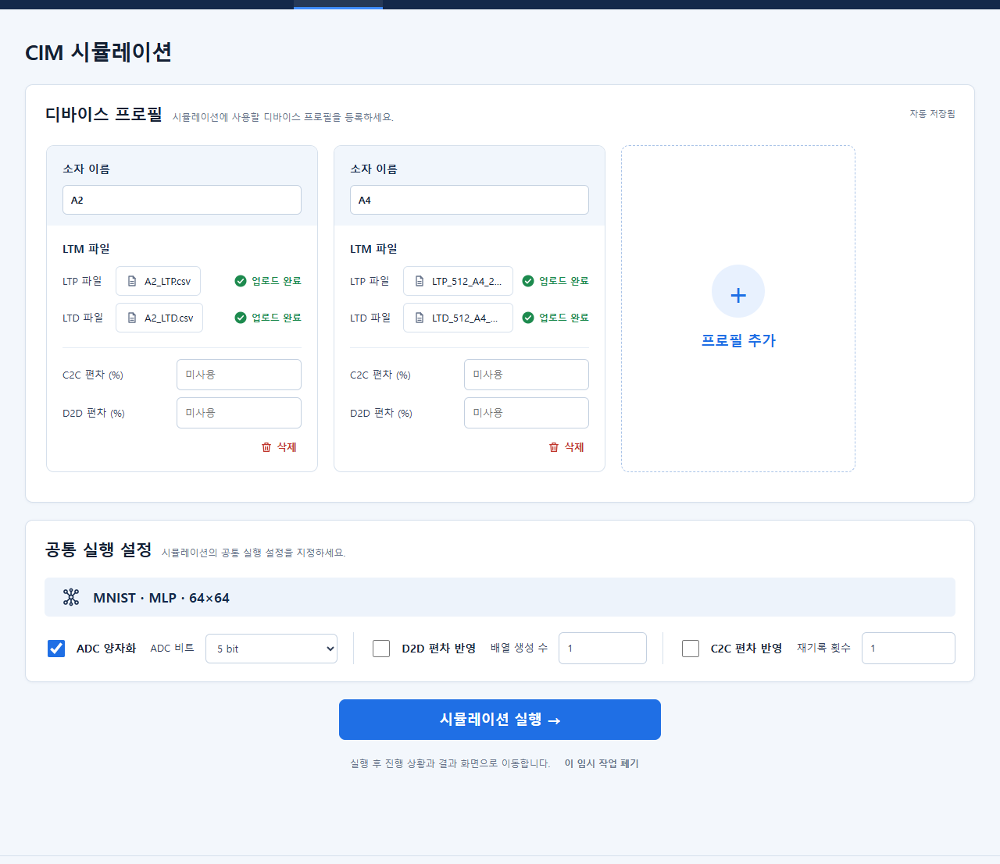

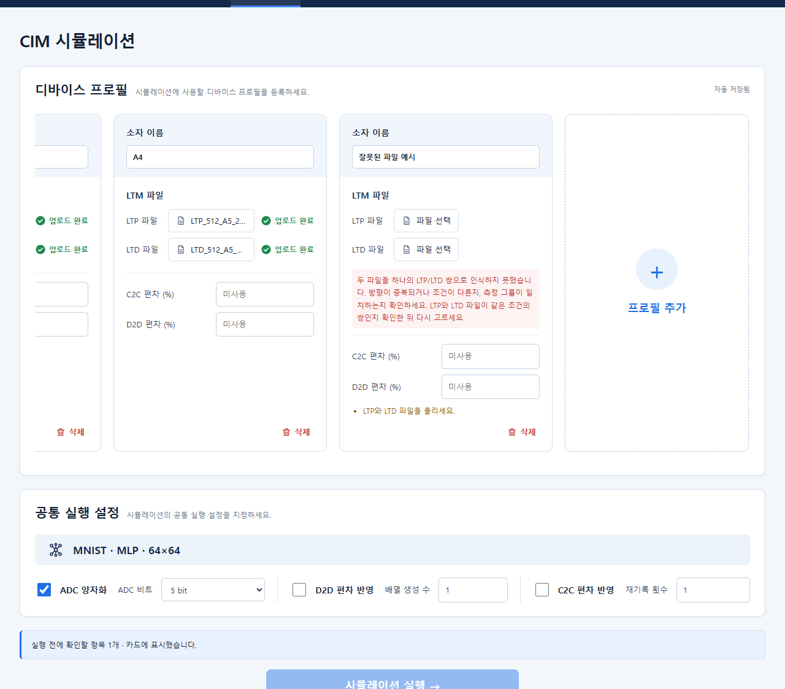


### 4-5. 실행
`시뮬레이션 실행 →`을 누르면 **진행 화면**으로 바뀝니다.

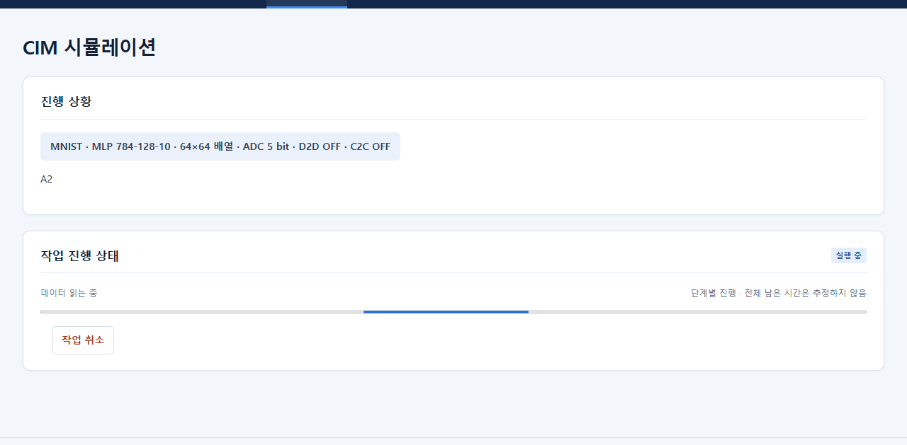

실행이 어느 정도 진행된 모습("추론 실행 중 · 3 / 5"):

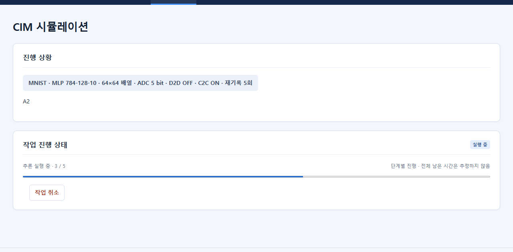

- 위쪽 파란 줄: 이 실행의 조건 요약. 그 아래 카드 이름.
- "작업 진행 상태": `대기` → `실행 중` + 지금 하는 단계(예: "데이터 읽는 중", "추론 실행 중 · 3 / 5"). **남은 시간은 추정해 보여 주지 않습니다.**
- **새로고침해도 실행이 중복 생성되지 않고** 같은 진행 화면으로 돌아옵니다(확인함).
- `작업 취소`: 누르면 중단합니다. **취소한 결과는 "취소" 표시와 함께 그때까지 끝난 반복만의 평균**이 나옵니다(예: 5회 중 4회 → "(4회 평균)"). 완료된 결과가 아니므로 비교·보고에 쓰지 마세요.

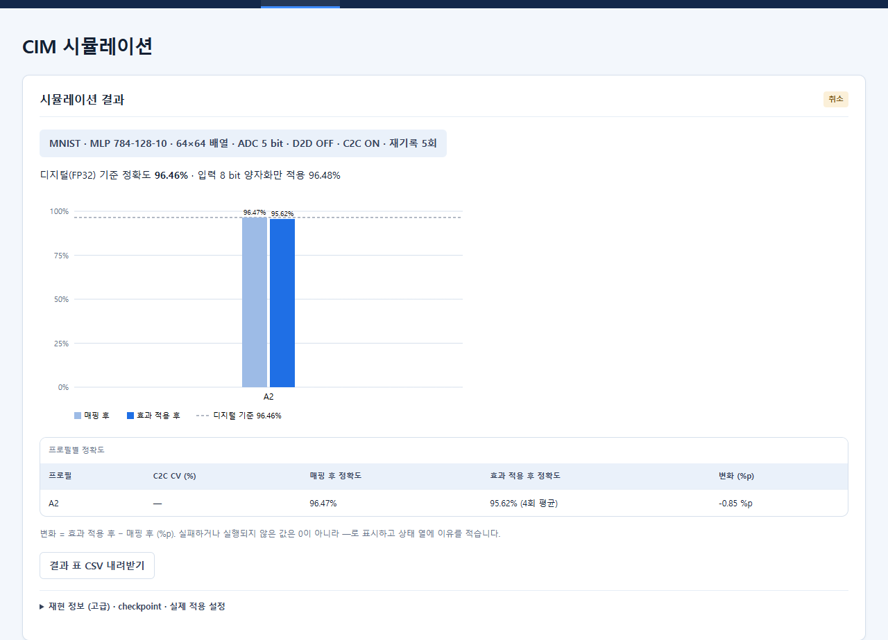

### 4-6. 결과 읽기

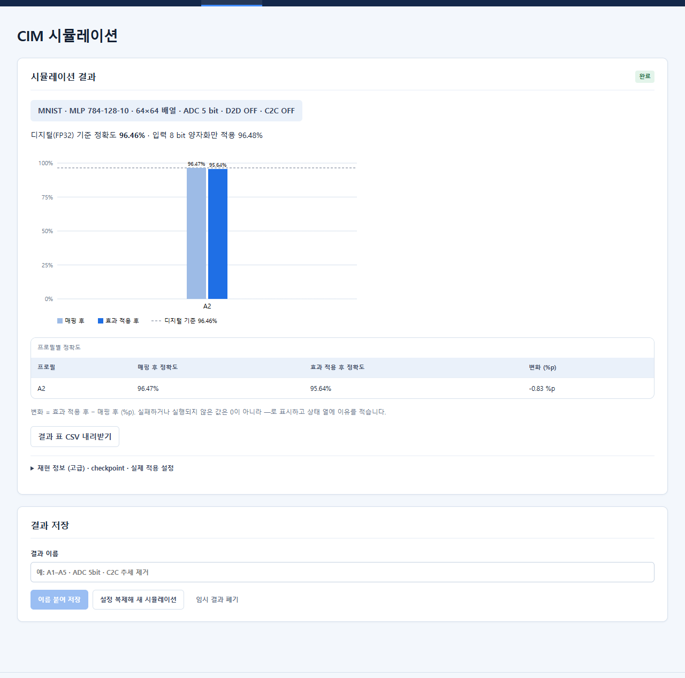

위에서부터:
1. **완료** 배지, 조건 줄(`MNIST · MLP 784-128-10 · 64×64 배열 · ADC 5 bit · D2D OFF · C2C OFF`).
2. **"디지털(FP32) 기준 정확도 96.46% · 입력 8 bit 양자화만 적용 96.48%"** — 소자 효과 없이 계산한 기준입니다. 모든 프로필에 공통이라 한 번만 나옵니다.
3. 막대그래프: 프로필마다 **옅은 파랑 = 매핑 후**, **진한 파랑 = 효과 적용 후**, 점선 = 디지털 기준.
4. 표 **"프로필별 정확도"**.

| 말 | 뜻 |
|---|---|
| **매핑 후 정확도 (%)** | 신경망 가중치를 실측 전도도 상태로 옮겼을 뿐, 편차·ADC는 아직 적용하지 않은 정확도 |
| **효과 적용 후 정확도 (%)** | 위에 ADC 양자화(켰다면)와 D2D·C2C 편차(켰다면)를 적용한 정확도. 반복(배열·재기록)이 여러 번이면 **평균**이고 `(5회 평균)`처럼 표시 |
| **변화 (%p)** | 효과 적용 후 − 매핑 후. **"퍼센트포인트"**: 96.47 % → 95.64 % 이면 −0.83 **%p** (정확도가 0.83 *퍼센트포인트* 내려감). "−0.83 %"가 아닙니다 |
| 값 `—` | 실패하거나 실행되지 않은 값. **0으로 표시하지 않고** `—`로 두고 이유를 적습니다 |

- 표 아래 `결과 표 CSV 내려받기`: 화면에 보이는 표 그대로(프로필, 편차 %, 매핑 후, 효과 적용 후, 변화, 조건 줄, 마지막 줄에 디지털 기준)가 CSV로 내려옵니다. 음수 변화도 `-0.84 %p`처럼 그대로 나옵니다.
- `재현 정보 (고급) · checkpoint · 실제 적용 설정`을 펼치면 실제 적용된 입력값이 나옵니다(전문가용).

### 4-7. 저장
결과 화면 아래 **"결과 저장"** 상자:
1. **결과 이름**을 씁니다(예: `예제 2 · C2C 전체 변동 6.0755`).
2. **C2C를 켠 실행이면** **"C2C CV 입력값의 기준"** 을 반드시 하나 고릅니다: `전체 변동` / `추세 제거 후 변동` / `직접 가정`. (그 숫자를 어디서 가져왔는지 기록하는 용도입니다. 두 값을 동시에 입력하는 기능은 아닙니다.)
3. `이름 붙여 저장`. 이름과(필요하면) 기준을 고르기 전에는 버튼이 비활성(연한 색)입니다.

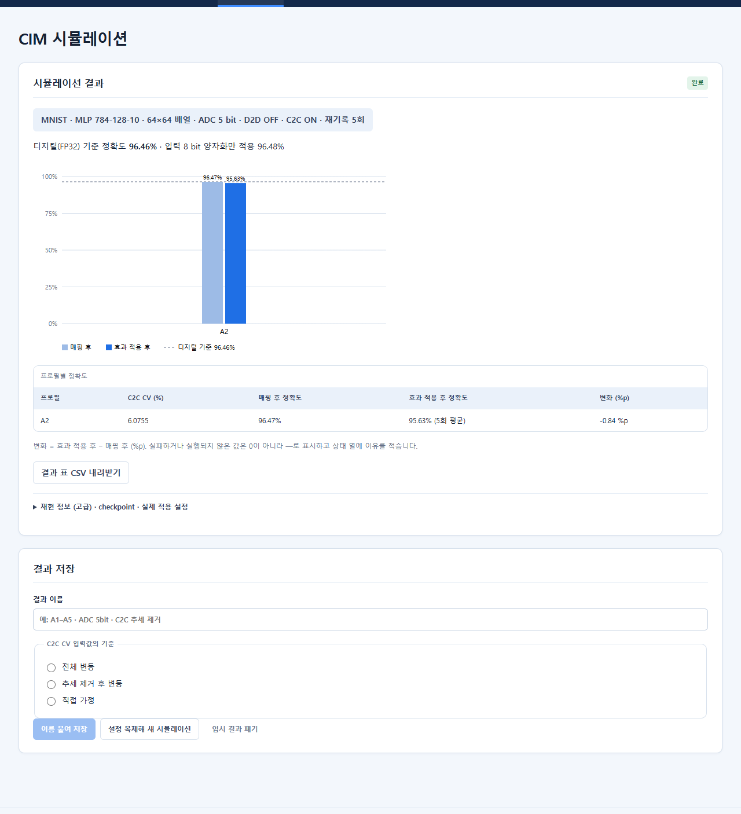

저장 직후:

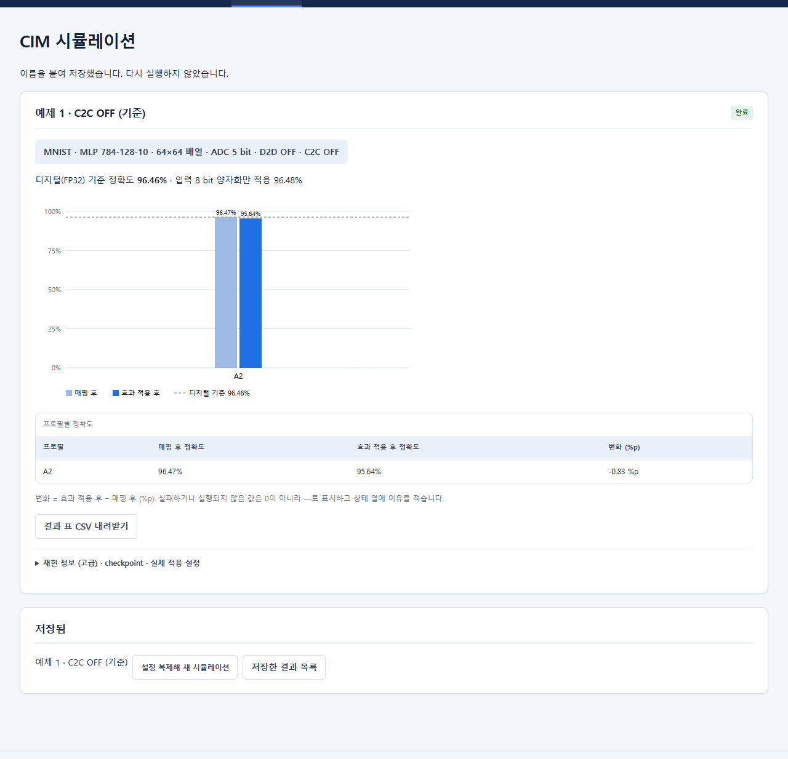

저장하면 "이름을 붙여 저장했습니다. **다시 실행하지 않았습니다.**"가 나오고, 결과 화면 조건 줄 끝에 `C2C 입력 기준: 전체 변동`처럼 기록됩니다. 저장하지 않은 결과는 **임시 작업**으로 남습니다.

### 4-8. 재조회 · 복제 · 폐기
상단 메뉴 **"저장한 결과"**:

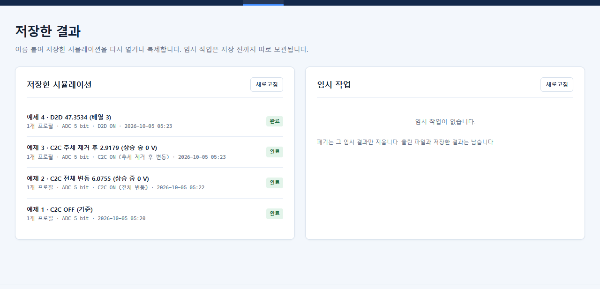

- **재조회**: 목록에서 이름을 누르면 그 결과가 아래에 열립니다. 새로고침하거나 서버를 껐다 켜도 그대로입니다(확인함).
- **복제**: `설정 복제해 새 시뮬레이션` → **같은 파일·같은 설정이 채워진 새 임시 작업**이 열립니다. 원본 저장 결과는 바뀌지 않습니다. 값만 바꿔 다시 실행하기에 좋습니다.
- **폐기**: 저장하지 않은 임시 결과/작업 화면의 `임시 결과 폐기`(또는 입력 화면의 `이 임시 작업 폐기`). **그 임시 결과만 지우고, 올린 파일과 저장한 결과는 지우지 않습니다.** 저장한 결과에는 폐기 버튼이 없습니다.
- **다운로드**: 시뮬레이션은 화면의 **`결과 표 CSV 내려받기` 한 가지**입니다(파일 이름: `<저장 이름>_결과.csv`). 체크포인트·배열 기록 같은 내부 파일은 사용자 목록에 나오지 않습니다.

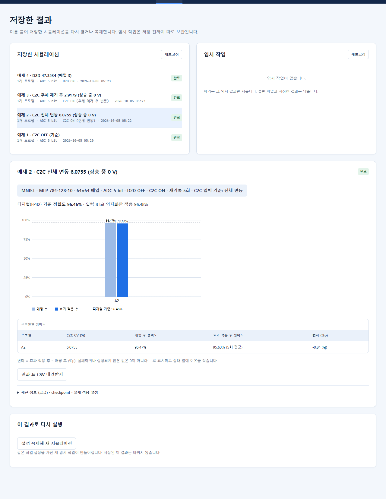

복제하면 같은 파일·설정이 채워진 새 입력 화면이 열립니다(저장 결과 "예제 1"을 복제한 모습):

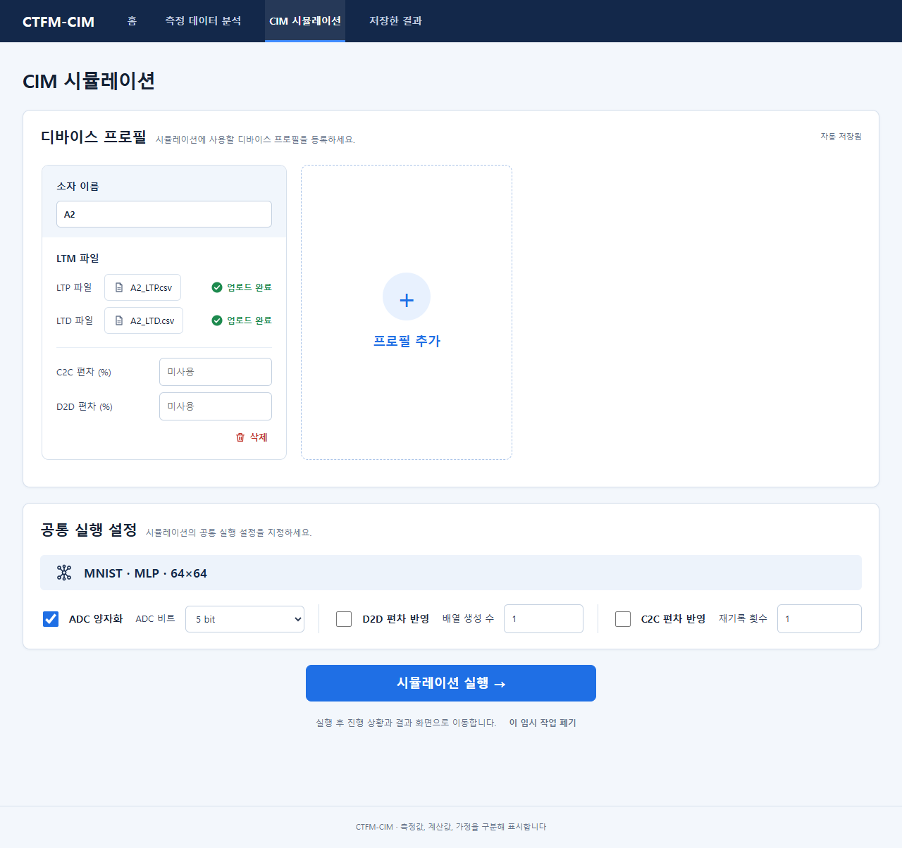
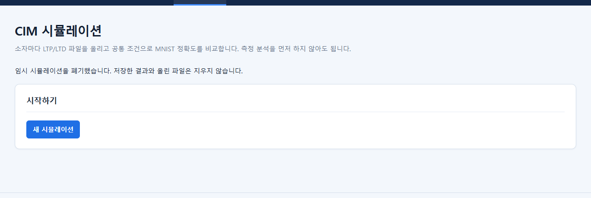

## 5. 실제 실행 예제 (그대로 따라 해 보세요)

### 5-1. 공통 조건 (네 번 모두 같음)
| 항목 | 값 |
|---|---|
| 프로필 | **A2** — `A2_LTP.csv`, `A2_LTD.csv` (한 번 올린 같은 프로필을 복제로 재사용) |
| ADC | 켜짐, **5 bit** |
| 모델·데이터 | MNIST MLP 784-128-10, 시험 10,000장, 64×64 배열, 입력 8 bit |
| 엔진 | **AIHWKit** (`aihwkit_ideal`, 버전 1.1.0) — 모든 "매핑 후/효과 적용 후" 값. 디지털 기준(D0, D1)은 설계상 PyTorch 계산 |
| 모델 가중치 | 매 실행 같은 방식으로 학습해 **같은 가중치** (4개 실행의 모든 가중치 텐서가 정확히 같음을 `torch.equal`로 확인) |
| 디지털 기준 | FP32 96.46 %, 입력 8 bit 96.48 % (네 번 모두 같음) |
| 매핑 후 | 96.47 % (네 번 모두 같음) |

### 5-2. 실행 목록과 결과
| 저장 이름 | 바꾼 것 | 입력값 | 배열/재기록 | 효과 적용 후 (각 반복) | 평균 | 변화 |
|---|---|---|---|---|---:|---:|
| 예제 1 · C2C OFF (기준) | C2C·D2D 꺼짐 (ADC만) | — | 1 | 95.64 | **95.64 %** | −0.83 %p |
| 예제 2 · C2C 전체 변동 | C2C 켬 | **6.0755** | 재기록 5 | 95.57, 95.71, 95.47, 95.77, 95.61 | **95.63 %** | −0.84 %p |
| 예제 3 · C2C 추세 제거 후 | C2C 켬 | **2.9179** | 재기록 5 | 95.80, 95.84, 95.67, 95.73, 95.84 | **95.78 %** | −0.69 %p |
| 예제 4 · D2D | D2D 켬 (C2C 꺼짐) | **47.3534** | 배열 3 | 87.71, 86.49, 84.74 | **86.31 %** | −10.16 %p |

- 예제 2·3은 **ADC, 재기록 횟수, 프로필, 가중치가 같고 C2C 입력값만 다릅니다.** 예제 1은 기준(C2C 없음)입니다.
- 입력값이 실제 계산에 전달됐는지: 실행 기록의 "실제 적용 설정"에 `6.0755 %`, `2.9179 %`, `47.3534 %`가 그대로 기록되었고, 실제로 만들어진 무작위 배율의 퍼짐(경험 CV)이 예제 2에서 0.0610, 예제 3에서 0.0293으로 입력(0.0608, 0.0292)과 일치했습니다.

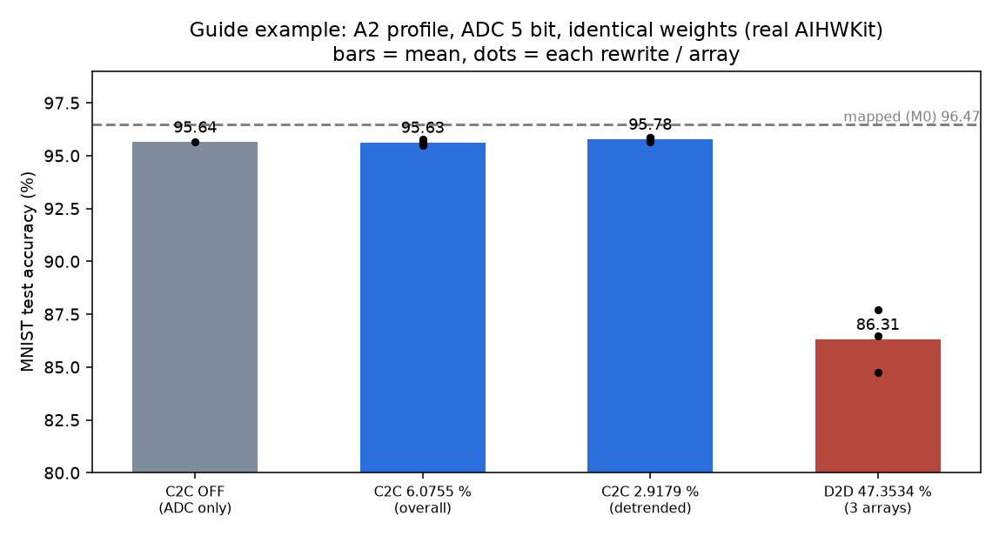

막대는 평균, 점은 반복(재기록·배열) 하나하나의 값입니다. 예제 1·2·3의 막대 높이 차이는 점들이 퍼진 폭 안에 있습니다.

예제 4(D2D)의 화면:

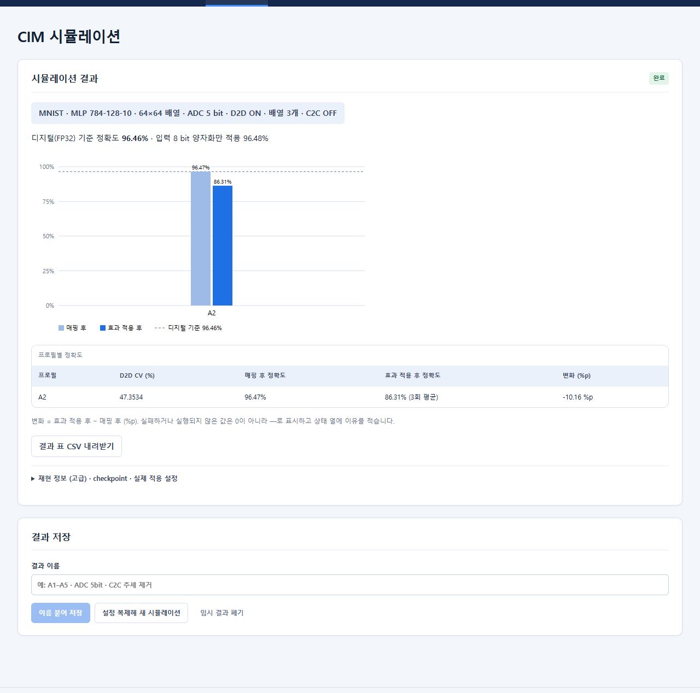

### 5-3. 결과를 어떻게 해석하나 (과장하지 않기)
- **예제 2(전체 변동)와 예제 3(추세 제거 후)의 차이는 0.15 %p**이고, 각 실행의 반복별 흔들림은 약 0.07~0.12 %p(표본 표준편차)입니다. 반복 5회로는 이 둘의 우열을 **믿을 만하게 가를 수 없습니다.** "추세 제거 값이 정확도에 더 유리하다"거나 반대로 말하면 안 됩니다. 확실히 비교하려면 재기록 횟수를 늘려야 합니다.
- **예제 1(C2C 없음)과 예제 2·3의 차이도 작습니다.** 예제 3이 기준보다 *높게* 나온 것은 "C2C가 정확도를 높였다"는 뜻이 아니라, 이 정도 크기의 잡음에서는 정확도가 반복마다 ±0.1 %p 정도 흔들린다는 뜻으로 읽어야 합니다. 이 조건(ADC 5 bit)에서는 ADC 양자화가 정확도 하락(−0.83 %p)의 대부분을 만들고, 2.9~6.1 % 수준의 C2C는 그 위에 **눈에 띄는 차이를 더하지 못했습니다.**
- 같은 프로필·같은 설정을 복제해 다시 돌리면 같은 평균(95.63 %)이 다시 나옵니다. 하지만 **같은 파일을 새로 올려 새 프로필을 만들면** 무작위 수가 달라져 C2C·D2D 결과가 조금 달라질 수 있습니다(난수가 프로필 기록에 묶여 있음).
- **예제 4(D2D 47.35 %)는 −10.16 %p로 큰 차이**가 납니다. 배열 3개의 값이 84.74~87.71 %로 퍼져 있으므로 평균 86.31 %를 "한 점 값"으로 읽지 말고 이 범위로 읽으세요. D2D 값은 **두 소자만으로 구한 대표값**이며 로그정규 분포·모든 상태에 같은 편차를 적용한다는 **가정**을 포함합니다.
- 숫자 6.0755 %, 2.9179 %는 대표 스윕 구간(초기/상승/하강)이 아직 정해지지 않은 상태에서 **상승 중 0 V를 예로 고른** 값입니다. **연구적으로 승인된 대표값이 아닙니다.** 다른 구간을 고르면 값이 크게 달라집니다(measurement-analysis-guide 4장 표: A2 하강 중은 2.51 % / 2.49 %).

## 6. 자주 묻는 것

| 질문 | 답 |
|---|---|
| 측정 분석을 안 하면 안 되나? | 안 해도 됩니다. 다만 C2C·D2D 숫자를 얻으려면 측정 분석이 필요합니다. |
| 파일이 한 쌍으로 안 읽힘 | LTP와 LTD가 같은 조건의 쌍인지 확인하고 다시 고르세요. 둘 다 같은 방향(예: LTP 두 개)이면 안 됩니다. |
| C2C/D2D 칸이 `미사용` | 공통 설정에서 해당 항목을 켜면 입력할 수 있습니다. |
| 결과가 너무 오래 걸림 | 재기록 횟수·배열 수·카드 수에 비례합니다. 먼저 작은 값으로 시험하세요. |
| 서버를 껐다 켜면? | 저장한 결과·올린 파일은 남습니다. **실행 중이던 작업은 중단**됩니다. |
| 시간이 한국 시간보다 9시간 이름 | 화면 시각은 UTC입니다. |

## 7. 알려진 제한 (이번 확인에서 드러난 것)

- 이름·값 입력은 자동 저장되지만, 파일 선택창에서 고르는 단계는 사용자가 직접 해야 합니다.
- 취소한 실행의 부분 결과를 저장할 수 있는지는 확인하지 않았습니다. 저장하지 말고 폐기하세요.
- 실행 도중 계산이 **실패**했을 때의 화면(`—`와 상태 열 사유)은 의도적으로 실패를 일으켜 보지 않았습니다(문구는 화면의 안내문 기준). 실행 *시작* 단계의 실패(엔진 미인식)는 확인했습니다(local-run-guide 6장).

## 8. 근거 (전문 내용)

### 8-1. 편차를 적용하는 식
```text
c   = CV(%) / 100
τ   = sqrt( log(1 + c²) )                # 구현은 log1p 사용
Z   ~ Normal(0, 1)
F   = exp( −τ²/2 + τ·Z )                 # 평균 1, 표준편차 c 인 양의 배율
G_적용 = G_측정 × F                       # 양(+)·음(−) 전도도 두 평면 모두에 곱함
w_적용 = scale × ( G+_적용 − G−_적용 )
```
- D2D: **배열마다 고정**된 배율(배열 생성 수만큼 다른 배열), C2C: **재기록마다 새로** 뽑는 배율. 둘을 함께 켜면 배열별 D2D 배율 위에 재기록별 C2C 배율을 곱합니다.
- 입력 이미지마다 새 잡음을 만들지 않습니다. 원래 전도도 범위로 강제로 자르는(clipping) 처리는 하지 않습니다.
- 로그정규 분포와 "모든 상태에 같은 CV"는 **공학적 가정**이며 실측 분포가 그렇다는 증명이 아닙니다.
- Vth 표준편차(V)를 C2C/D2D 칸(전류·전도도 CV %)에 넣으면 안 됩니다.

### 8-2. 가중치 매핑 (독립 검산)
```text
scale = max|w| / (Gmax − Gmin)            # Gmin, Gmax: 그 프로필의 측정 전도도 범위
G±    = 측정 상태 중 ( Gmin + |w|/scale ) 에 가장 가까운 값
w'    = scale × (G+ − G−)
```
A2 프로필(LTP 510 + LTD 510 = 1020 상태, Gmin 4.95 µS ~ Gmax 38.0 µS)에서 매핑 코드를 따로 구현해 비교했을 때 `fc1` scale 14608.678226, `fc2` scale 17510.805837, **G+/G− 배열이 비트 단위로 일치**했습니다. 매핑된 가중치를 float64로 평가하면 96.46 %(AIHWKit float32 엔진은 96.47 %: 시험 이미지 1장 차이로 수치 정밀도 차이).

### 8-3. 이번 예제의 확인 증거 (로컬 보관, git 제외)
`local_report/33-evidence/` 의 `guide_simulator_numbers.json`(네 실행의 모든 반복 값), `guide_ckpt_equal.txt`(가중치 동일), `guide_factor_stats.txt`(주입 배율 CV), `guide_simulator_log.txt`.

### 8-4. 내부 고정 조건
엔진 `aihwkit_ideal`, 난수 시드 20260917, 타일 64, ADC 순서 `adc_then_subtract`, 범위 정책 `validation_max_abs`, 모델 `mnist_mlp_v1`, 전도도 풀 `combined`(LTP+LTD 전체), 매핑 `fixed_reference`. Retention은 켤 수 없음(서버 거절: `outside_product_scope`).
